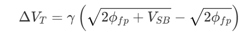

# Second Order Effects in MOSFETS: Body Effect

Imagine you are trying to lift a heavy metallic door using a powerful electromagnet. Normally, it takes a certain amount of magnetic force to open it. But what if someone sneaks into the basement and attaches thick bungee cords to the bottom of the door, pulling it downwards? Suddenly, your electromagnet has to pull *much* harder to lift that exact same door.

This is the exact intuition behind the **Body Effect** (also known as the substrate bias effect) in MOSFETs!

## **The Physical Mechanism**

In standard MOSFET analysis, we usually assume the substrate (or body) and the source are connected to the same ground potential, making the source-to-body voltage *V_SB*=0. However, in many integrated circuit configurations, the source and body are not at the same potential.

When we apply a reverse-bias voltage between the source and the substrate (*V_SB*>0), we are effectively pulling on those "bungee cords". This reverse bias forces the space charge (depletion) region in the substrate to widen. In a standard n-channel device, the surface normally inverts to form the channel when the surface potential *ϕs* reaches 2*ϕfp*. But with *V_SB*>0, the newly created inversion electrons are at a higher potential energy than the electrons in the source. To actually form the channel and allow conduction, the surface potential must be pushed even higher to overcome this extra energy barrier, specifically requiring 

*ϕ_s*=2*ϕ_fp*+*V_SB*

Because the depletion region is now wider, the gate must supply additional positive charge to compensate for the increased negative space charge of the uncovered acceptor ions. The ultimate result? It takes a higher gate voltage to turn the transistor on.

## **The Mathematical Elegance**

Let's express this beautifully in mathematical terms. To reach the new threshold condition, the change in the required gate voltage (Δ*VT*) directly correlates to the change in the space charge density (Δ*Q_SD*′).

By evaluating the charge in the widened depletion region, we can rigorously define the shift in the threshold voltage as: 

Here, we introduce *γ*, which is formally defined as the **body-effect coefficient:**

[](data:image/svg+xml;utf8,<svg xmlns="http://www.w3.org/2000/svg" width="400em" height="1.28em" viewBox="0 0 400000 1296" preserveAspectRatio="xMinYMin slice"><path d="M263,681c0.7,0,18,39.7,52,119%0Ac34,79.3,68.167,158.7,102.5,238c34.3,79.3,51.8,119.3,52.5,120%0Ac340,-704.7,510.7,-1060.3,512,-1067%0Al0 -0%0Ac4.7,-7.3,11,-11,19,-11%0AH40000v40H1012.3%0As-271.3,567,-271.3,567c-38.7,80.7,-84,175,-136,283c-52,108,-89.167,185.3,-111.5,232%0Ac-22.3,46.7,-33.8,70.3,-34.5,71c-4.7,4.7,-12.3,7,-23,7s-12,-1,-12,-1%0As-109,-253,-109,-253c-72.7,-168,-109.3,-252,-110,-252c-10.7,8,-22,16.7,-34,26%0Ac-22,17.3,-33.3,26,-34,26s-26,-26,-26,-26s76,-59,76,-59s76,-60,76,-60z%0AM1001 80h400000v40h-400000z"></path></svg>)

[](data:image/svg+xml;utf8,<svg xmlns="http://www.w3.org/2000/svg" width="400em" height="1.28em" viewBox="0 0 400000 1296" preserveAspectRatio="xMinYMin slice"><path d="M263,681c0.7,0,18,39.7,52,119%0Ac34,79.3,68.167,158.7,102.5,238c34.3,79.3,51.8,119.3,52.5,120%0Ac340,-704.7,510.7,-1060.3,512,-1067%0Al0 -0%0Ac4.7,-7.3,11,-11,19,-11%0AH40000v40H1012.3%0As-271.3,567,-271.3,567c-38.7,80.7,-84,175,-136,283c-52,108,-89.167,185.3,-111.5,232%0Ac-22.3,46.7,-33.8,70.3,-34.5,71c-4.7,4.7,-12.3,7,-23,7s-12,-1,-12,-1%0As-109,-253,-109,-253c-72.7,-168,-109.3,-252,-110,-252c-10.7,8,-22,16.7,-34,26%0Ac-22,17.3,-33.3,26,-34,26s-26,-26,-26,-26s76,-59,76,-59s76,-60,76,-60z%0AM1001 80h400000v40h-400000z"></path></svg>)

In this elegant parameter, *e* is the elementary charge, *ϵ_s* is the semiconductor's permittivity, *N_a* is the substrate's acceptor doping concentration, and *C_ox* is the oxide capacitance per unit area.

As you can see from the mathematics, Δ*V_T* is always positive for an n-channel device, meaning the threshold voltage will inevitably increase as a function of the source-to-body junction voltage.

## **How body effect affects the *I_D* vs. *V_GS g*raph**

Remember our heavy metallic door with the bungee cords pulling it down from our previous discussion? Because the body effect (applying a reverse-bias source-to-body voltage,*V_SB*>0) effectively adds more "bungee cords," it takes a much higher gate voltage just to crack the door open, meaning the threshold voltage (*V_T*) increases

Now, let's look at exactly how this mathematically and physically strangles the flow of electrons - our drain current (*I_D*) - across the I-V characteristics!

To understand the I-V changes, you only need to look at the term (*V_GS*−*V_T*). This term is the "driving force" or "overdrive voltage" of the transistor. Because the body effect increases *V_T*, the value of (*V_GS*−*V_T*) inevitably shrinks for any fixed gate voltage. Here is how that alters the three main pieces of the I-V graph:

**1. The Nonsaturation (Linear) Region**

When the drain-to-source voltage (*V_DS*) is small, the transistor acts like a voltage-controlled resistor. The mathematically elegant equation for the drain current in this region is:

Because our *V_T* parameter has increased due to the body effect, the (*V_GS*−*V_T*) multiplier becomes smaller. Physically, this means the inversion layer is less densely packed with electrons, so the channel's initial conductance drops. Graphically, the initial slope of the *I_D* versus *V_DS* curve becomes much flatter.

**2. The Saturation Region** When we push the transistor into saturation, the current is supposed to level off to a maximum value. The beautiful square-law equation governing this is: 

Because the drain current here relies on the

*square* of (*V_GS*−*V_T*), the body effect brutally punishes the saturation current. An increase in

*V_T* from the body effect causes the total saturation current to drop quadratically. If you were to plot the *I_D*(*sat*) versus *V_GS*, applying a *V_SB* shifts the entire straight-line curve to the right, pointing to the new, higher threshold voltage.

**3. The Pinch-Off Point (***V_DS*(*sat*)**)**

The body effect also changes *when* the transistor saturates. The drain voltage required to pinch off the channel at the drain terminal is given by:

[](data:image/svg+xml;utf8,<svg xmlns="http://www.w3.org/2000/svg" width="400em" height="1.28em" viewBox="0 0 400000 1296" preserveAspectRatio="xMinYMin slice"><path d="M263,681c0.7,0,18,39.7,52,119%0Ac34,79.3,68.167,158.7,102.5,238c34.3,79.3,51.8,119.3,52.5,120%0Ac340,-704.7,510.7,-1060.3,512,-1067%0Al0 -0%0Ac4.7,-7.3,11,-11,19,-11%0AH40000v40H1012.3%0As-271.3,567,-271.3,567c-38.7,80.7,-84,175,-136,283c-52,108,-89.167,185.3,-111.5,232%0Ac-22.3,46.7,-33.8,70.3,-34.5,71c-4.7,4.7,-12.3,7,-23,7s-12,-1,-12,-1%0As-109,-253,-109,-253c-72.7,-168,-109.3,-252,-110,-252c-10.7,8,-22,16.7,-34,26%0Ac-22,17.3,-33.3,26,-34,26s-26,-26,-26,-26s76,-59,76,-59s76,-60,76,-60z%0AM1001 80h400000v40h-400000z"></path></svg>)

Since *V_T*  is larger, *V_DS*(*sat*) becomes smaller. This means the transistor channel pinches off earlier, entering the saturation region at a lower drain voltage than it normally would.

**The Big Picture View**

If you look at the classic *I_D*  versus *V_DS* graph, turning on the body effect effectively "squashes" the entire family of curves downwards. For the exact same gate voltage, your transistor provides less channel conductance, pinches off earlier, and yields a severely reduced maximum current.