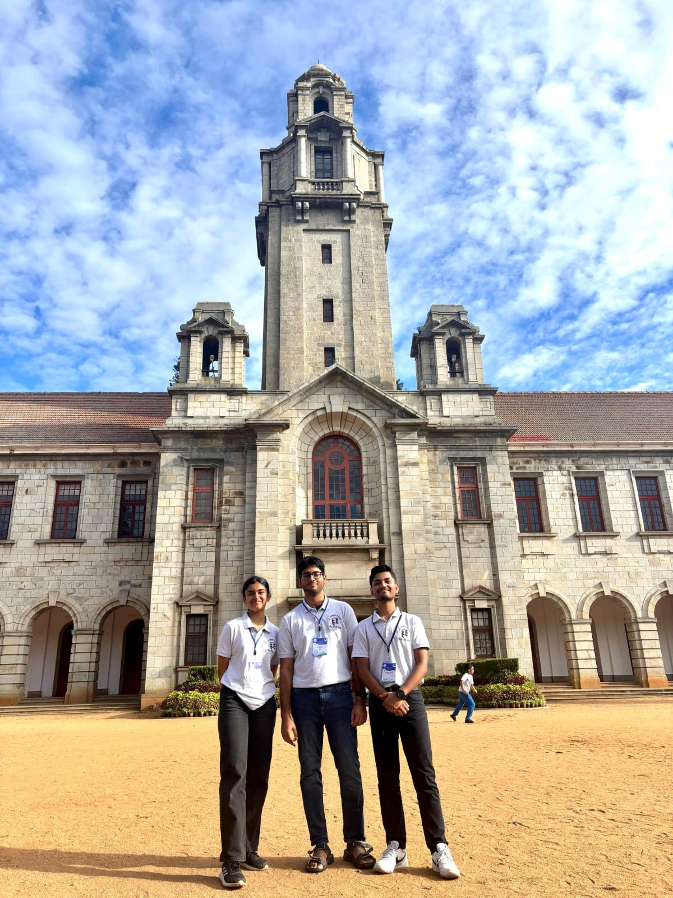

# Day 3 of Summer School- 2025 by Dept. of Electrical Engineering IISC

The third day of the workshop at the Indian Institute of Science (IISc) began with breakfast, followed by one of the most anticipated experiences of the program - the Electrical Engineering (EE) Lab visits. Walking through the laboratories provided a glimpse into the infrastructure that supports cutting-edge research. From advanced power electronics setups to experimental systems, every lab reflected the strong research culture that IISc is known for.

After a short tea break, we attended an engaging session on **Life at IISc**, where Prof. Soma and Prof. Kiran Kumari shared insights into the academic environment, research opportunities, and student life. Their discussion offered a realistic perspective on what it means to pursue higher studies and research at one of India's premier institutions. Beyond academics, they highlighted the importance of curiosity, collaboration, and perseverance in a research career.

The highlight of the afternoon was the **Research Students Symposium Poster Session**, where PhD and research students presented their ongoing work. The diversity of topics showcased the multidisciplinary nature of engineering research at IISc.

Some of the fascinating research areas included:

- Electric vehicle charging technologies and multi-port power converters
- Machine learning topics such as Generalized Category Discovery and prompt tuning of Vision-Language Models for few-shot learning
- Electromagnetic bearings and high-frequency magnetic material characterization
- Speech technology, including dysarthric speech processing and articulatory analysis using real-time MRI
- Advanced electric machines, grid-connected inverter control, and smart grid cybersecurity
- Lensless imaging using diffusion models
- Auditory attention decoding and gravity data analysis
- Aircraft-initiated lightning studies and ultracapacitor voltage balancing
- An impressive demonstration of the MIT Coffee Can Radar

The poster session was especially valuable because it allowed participants to interact directly with researchers. Unlike formal presentations, the poster format encouraged open discussions, enabling us to ask questions about methodologies, experimental setups, challenges, and future applications. It was inspiring to see how fundamental research translates into practical solutions for energy systems, artificial intelligence, healthcare, communication, and sustainability.

Following the lunch break, we attended a session introducing **IEEE**. The session highlighted the role of IEEE in advancing technology worldwide through conferences, publications, technical societies, standards development, and professional networking. It also emphasized the opportunities available to students, including access to research resources, competitions, leadership roles, and collaborations with the global engineering community.

The workshop concluded with the **Closing Ceremony**, marking the end of two enriching days of learning and interaction. Looking back, the workshop offered much more than technical knowledge, it provided exposure to world-class research, opportunities to engage with faculty and research scholars, and a deeper understanding of the innovation ecosystem at IISc.

The experience reinforced an important takeaway: research is not simply about solving existing problems, but about asking meaningful questions, exploring new ideas, and contributing knowledge that can shape the future. Leaving the campus, I carried home not only new technical insights but also renewed motivation to pursue research with curiosity and purpose.

