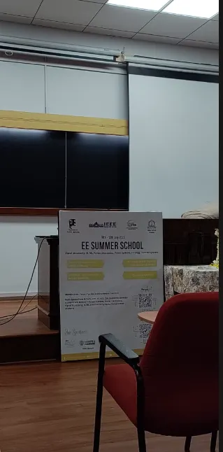

# Day 1 of Summer School- 2025 by Dept. of Electrical Engineering IISC

EE Summer School 2025

Department of Electrical Engineering, Indian Institute of Science (IISc), Bangalore, in collaboration with the IEEE Bangalore section, IEEE PES Bangalore Chapter and several other IEEE technical chapters, organised **EE Summer School 2025** for undergraduate students ( B.Tech — EEE, EE, ECE, CSA 5th/6th/7th semester students) and Post graduate students ( MTech — Power Systems, Power Electronics, Signal Processing, AI/ML and Control Systems, 3rd semester students ) **from 10–12 July 2025**. This 3-day summer school was hosted in EE, IISc, Bangalore. I had the privilege of attending this highly selective summer school and had the opportunity to meet so many fellow students from the all over the country.

IISC Main Building

The objective was to encourage brilliant young minds to build careers in core engineering disciplines such as Electrical Engineering including Signal Processing, Power Electronics, Power Systems, Renewable Integration, High Voltage Engineering, and Control Systems. There were talks and demonstrations by IISc faculty, research students, and industry professionals to introduce the us to the opportunities and challenges in core engineering disciplines and let us know about the applications, current challenges, and emerging trends.

IISC Main Building

## **Day 1 — Thursday ( 10/07/2025):**

The day began pretty early at 7:45am with breakfast followed by registration.

We then made our ways to the classroom in the Electrical Engineering building.

The Summer School Commenced with a short inaugural ceremony.

EE Summer School Inaugural Ceremony

This was followed by our first talk given by Professor Dr. SASTRY P S.

Professor Dr. SASTRY P S.

Prof. Sastry gave us a glimpse of the history of IISC and the various opportunities offered by IISC. He gave a detailed breakdown of the various programs offered by IISC and the process to enroll ourselves to this institution.

This was then followed by an introductory talk by Professor Dr. Uday Kumar. His talk included a comprehensive breakdown of the research opportunities at IISC. Professor spoke about the current scheme of division of domains at the department of Electrical Engineering which is stream 1 and stream 2. He further went on to introduce the various labs at EE and encouraged us to visit the website and apply to any labs that interest us.

Professor Dr. Uday Kumar.

This was then followed by a talk by Mr. Vishal Gopalakrishnan from Bloom Energy. He gave us an unbiased breakdown of the pros and cons of choosing a career in research as opposed to a career in the industry.

Mr. Vishal

He had quite a unique approach. We have an abundance of advice telling us “what to do”. Mr. Vishal told us “what not to do”, when it comes to making a decision for the the next phase of our lives.

This was followed by a tea break. I got the opportunity to network with such unique people.

EESS Classroom

The tea break was followed by a talk by Prof. Dr. Prasanta Kumar Ghosh. Professor heads the SPIRE (S i g n a l P r o c e s s i n g I n t e r p r e t a t i o n a n d R E p r e s e n t a t i o n L A B o r a t o r y) Labs at IISC.

Prof. Dr. Prasanta Kumar Ghosh.

Prof. Prasanta’s session gave us peep into how the voice assistants work. His talk included various pop culture references such as “open sesame”, “star trek”, “space odysseys”. He gave us an acronym to remember the overall pipeline in voice assistants:
ANT
A — Automatic Speech Recognition

N — Natural Language Understanding (NLU)

T — Text to speech synthesis (TTS)

He gave us a lot of case studies such as the digit classification problem and so on. Professor Prasanta gave us an overview of audio processing starting from spectrograms, followed by the deep learning algorithms that follow and concluded with text to audio conversion. He also spoke about the various challenges one would face in this domain.

This was then followed by research presentations by the Mtech and PHD students.

First we had a presentation by Harisyam PV who is a Ph.D. Scholar at IISc Bangalore, SPELL Lab, Electrical Engineering Department. His presentation was about ‘Making the Power Converters Smaller’.

Harisyam PV

We then had a talk by Syamala Mutnoory, who is an Mtech student at IISC. Her talk was about ‘Characterization and Voltage Balancing of Ultracapacitors’.

Syamala Mutnoory

This was followed by a talk by Soumya Dutta who is a PhD student at IISC. His talk was about ‘Emotion in Speech:Recognition and Synthesis’.

Soumya Dutta

Shashank S, who is a PhD scholar at IISC was the next speaker. He gave a talk on ‘A Cyber-Physical Modeling and Vulnerability Assessment Framework for Smart Grids’.

Shashank S

We had a quiz session after this.

Quiz Session

Following the lunch break, we had a session by Dr. Kiran Kumari.

Dr. Kiran Kumari

Dr. Kiran Kumari gave a talk on ‘Control-Theoretic Foundations for Robotics: Theory to Implementation’. She started the session by giving an introduction on control systems and feedback loops. She further went on to talk about the evolution of control theory. She spoke a bit about Lyapunov stability theory. Then she went on the show the work her students have done in the Ctrl lab.

IISC

After the session on control systems, we got to visit a few laboratories in the Electrical Department.

Sustainable Power Electronics Laboratory

We visited the SPELL laboratory.

@ SPELL

The interns there presented some of their works. They were working on EV charging ports.

@SPELL

@ SPELL

After this, we visited the High Power Lab.

High Power Lab

@ HPL

@ HPL

The research interns here presented their work. They were trying to solve the issues that arise when the power produced domestically is being sent back to the grid. They also presented their work on electromagnetic ball bearings.

@ HPL

@ HPL

After this we got to visit the Power Systems Laboratory. Here they presented their work related to controlling Power Grids remotely. They had also set up a miniature version of an end to end power grid which was pretty cool to see.

@ Power Systems Laboratory

The ride home :)