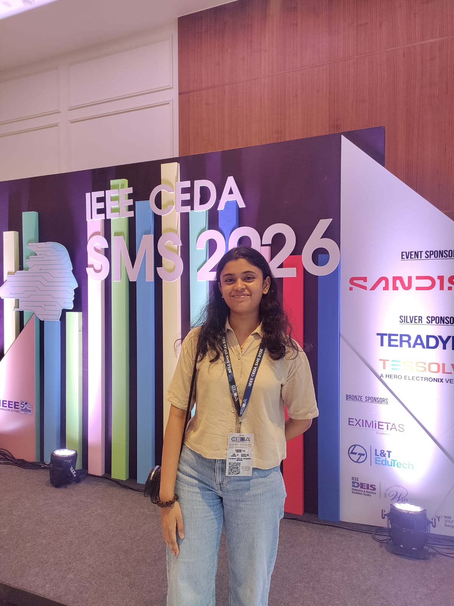

# My Experience at IEEE CEDA SMS 2026: Exploring India's Semiconductor Future

On 28th June 2026, I had the opportunity to attend the **IEEE CEDA Semiconductor Manufacturing Symposium (SMS 2026)** held at **DoubleTree by Hilton, Bengaluru Whitefield**. The symposium was organized under the theme **"Powering India's Semiconductor Future"**, bringing together industry leaders, researchers, students, and professionals passionate about semiconductor manufacturing.

As someone interested in electronics and emerging technologies, attending this event gave me valuable insights into one of the fastest-growing industries in the world.

## A Day Filled with Learning

The symposium featured keynote talks, technical sessions, panel discussions, and networking opportunities. The sessions covered the complete semiconductor manufacturing journey—from wafer fabrication and lithography to packaging, testing, and production.

One of the highlights was learning about the end-to-end semiconductor manufacturing process and understanding how complex chips are designed, fabricated, packaged, and tested before reaching consumers. The speakers explained these concepts in a practical and engaging manner, making even complex manufacturing processes easier to understand.

## India's Growing Semiconductor Ecosystem

A major theme throughout the event was India's rapid progress in building its semiconductor ecosystem. Industry experts discussed government initiatives, new fabrication facilities, advanced packaging technologies, and the increasing investments being made in the sector.

It was inspiring to see how India is positioning itself to become an important player in the global semiconductor supply chain. The discussions emphasized that this transformation will require skilled engineers across multiple disciplines, including Electronics, Mechanical, Chemical, and Civil Engineering.

## Insights from Industry Experts

The symposium featured experienced professionals from organizations such as **SanDisk, Samsung Semiconductor, Tata Projects, Teradyne, Lam Research, L&T Semiconductor Technologies, Tessolve, Arm, IISc**, and several other leading companies and institutions.

Listening to experts share their real-world experiences, industry challenges, and technological innovations provided valuable perspectives beyond what we usually learn in classrooms.

## Panel Discussions

The panel discussions were among the most engaging parts of the event.

The first discussion focused on **India's role in semiconductor manufacturing**, highlighting the country's opportunities, current challenges, and future roadmap.

The second panel explored **how the semiconductor job market is evolving** and what students and educational institutions need to do to remain relevant in an increasingly competitive industry. The speakers stressed the importance of practical skills, continuous learning, interdisciplinary knowledge, and industry collaboration.

## Networking and Career Inspiration

Apart from the technical sessions, the event offered excellent networking opportunities. Students had the chance to interact with professionals, researchers, and fellow participants who shared similar interests.

These conversations helped me better understand career paths in semiconductor manufacturing and reinforced the importance of staying updated with industry trends and developing practical technical skills.

## My Key Takeaways

- Semiconductor manufacturing involves far more than chip design—fabrication, packaging, testing, and process engineering all play equally important roles.
- India is making significant investments to become a global semiconductor hub.
- Practical skills, continuous learning, and industry exposure are essential for future engineers.
- Networking with professionals can open new perspectives and career opportunities.
- Events like IEEE CEDA SMS bridge the gap between academia and industry.

## Final Thoughts

Attending **IEEE CEDA SMS 2026** was an enriching experience. It expanded my understanding of semiconductor manufacturing while giving me a clearer picture of the industry's future in India.

The symposium demonstrated how collaboration between academia, industry, and government can accelerate innovation and prepare the next generation of engineers for exciting opportunities ahead.

I look forward to attending more such technical events and continuing to learn from experts who are shaping the future of technology.

