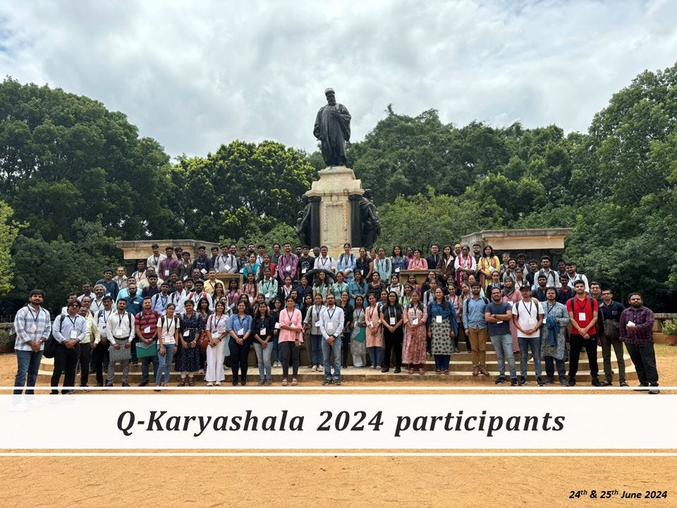

# Deep Dive into Q-Karyashala 2024

Quantum computing and next-generation materials are no longer just theoretical physics concepts -they are actively moving onto hardware chips. The **Q-Karyashala 2024** workshop brought together leading minds to map out the future of quantum photonics, superconducting systems, cryogenic memory, and neuromorphic computing.

Here is a breakdown of the key takeaways from the notes collected during this intensive workshop.

---

## 1. Quantum Photonics: The Power of Photonic ICs

**Speaker:** Prof. Shankar Kumar Selvaraja

One of the most promising avenues for building scalable quantum computers is **Photonic Integrated Circuits (ICs)**. Moving discrete, bulky optical setups onto flat, thin substrates (< 1 mm thick) vastly enhances functionality and performance.

- **Substrate Choice:** The choice depends heavily on the application. While electronic chips require conducting substrates, photonic platforms demand high transparency.
- **The Power of Qubits:** Unlike a classical bit (0 or 1), a qubit operates on a sphere (the Bloch sphere), meaning every point on the sphere represents a potential state, leading to an infinite number of positions. Entanglement leverages this exponentially: while 2 qubits represent a mirror bit, 10 qubits scale to $2^{10}$ values (1,024 classical bits). This power is critical for solving hard conventional problems like discovering human-safe chemical/fertilizer formulations.
- **Photonic Toolbox:** Building a photonic IC requires precise components: light sources, light coupling waveguides, wavelength filters, light modulators, and photodetectors.
- **Waveguide Scaling:** Light can be squeezed into tiny spaces by utilizing materials with a high refractive index contrast (like Silicon with $n_{\text{core}} = 3.45$ at $\lambda_0 = 1550\text{ nm}$, reducing the effective wavelength $\lambda$ to $450\text{ nm}$).
- **On-Chip Single Photon Sources:** Generating single photons must ideally be deterministic. Key techniques include Quantum Dots, Color Centers, Parametric Down-Conversion, and Four-Wave Mixing (4WM).

---

## 2. Quantum Materials & Neuromorphic Engineering

**Speaker/Project:** Prof. Pavan Nakula

The human brain uses around 20 watts of power to manage roughly $10^{11}$ neurons and $10^{15}$ synapses. In comparison, a digital emulation like SpiNNaker-1 requires 100 kW for just $10^9$ neurons. To bridge this massive efficiency gap, researchers are developing **neuromorphic materials** that inherently behave like neurons and synapses using components like **memristors**.

- **Electromechanical Signals:** Brain signals are not purely electronic; they are electromechanical and ionic transmissions resulting from phase transitions in cell membranes.
- **Phase Change Materials:** Compounds like Vanadium Dioxide ($\text{VO}_2$) undergo a Mott Metal-Insulator Transition (MIT) as temperature shifts. Despite having a partially filled 3d band that should theoretically make it a metal, it acts as an insulator at low temperatures due to electron-electron interactions—a direct failure of standard band theory.
- **Growth Tech:** These complex quantum layers are grown using precise methodologies like **Pulsed Laser Deposition (PLD)**.
    
    
    

---

## 3. Cryogenic Memory Technology

**Speaker:** Prof. Bhagwati Prasad

As microprocessors speed up, quantum computers hit a massive roadblock: the "Von Neumann bottleneck" or the **V-Time Dilemma**, where memory retrieval speeds cannot keep up with high-speed computation. Furthermore, control electronics for quantum processors must operate efficiently at cryogenic temperatures.

- **Volatile vs. Non-Volatile Options:** Traditional volatile memory (SRAM/DRAM) faces competition from non-volatile, resistance-based architectures like Resistive RAM (RRAM), Phase Change Memory (PCM), Ferroelectric Memory, and Spintronics.
- **MRAM Advancements:** Magnetoresistive RAM (MRAM) utilizes Magnetic Tunnel Junctions (MTJ). The magnetization is switched using current-induced methods such as **Spin-Transfer Torque (STT)** and the more energy-efficient **Spin-Orbit Torque (SOT)**.

---

## 4. Superconducting Quantum Systems

**Speaker:** Mohamed Hasan

Superconducting circuits are among the frontrunners for building reliable commercial quantum hardware.

- **Artificial Atoms:** Real atoms have natural quantum levels, but they are hard to trap and scale. By using a **Josephson Junction** (Superconductor–Insulator–Superconductor), engineers create a non-linear inductance that behaves like an **artificial atom** with discrete, controllable energy levels.
- **System Layout:** The architecture consists of a Quantum Processing Unit (QPU) containing the superconducting qubits, microwave resonators for readout, and cryogenic amplifiers to boost weak qubit readout signals with high fidelity.
- **EDA Engineering Workflow:** Setting up these chips involves rigorous Electronic Design Automation (EDA), electromagnetic (EM) layout simulations, and solving cross-Kerr anharmonicities and resonance frequencies.
- 

---

## 5. Quantum Random Number Generation (QRNG)

**Speaker/Project:** Prof. Kausik Majumdar

True randomness is vital for cryptography, secure hardware communications, digital money, and large-scale simulations.

- **Measuring Randomness:** Randomness is validated using Shannon Entropy ($H_1 = -\sum (P_i) \log_2 P_i$) and Min-Entropy ($H_\infty = \min(-\log_2 p_i)$), which gauges the predictability of a single guess.
- **The Quantum Path:** Passing a single photon through a beam splitter places it in a superposition of paths. When measured, the photon randomly collapses into one path or the other. While photon arrival follows a Poisson process (non-uniform timing), whether a detector clicks forms an excellent, unbiased source of absolute entropy.

---

## 6. Probing Quantum Heterostructures & Quantum Dots

**Speakers:** Prof. Srimanta Middey & Prof. Anshu Pandey

To engineer nanoscale quantum materials, researchers rely on sophisticated growth and diagnostic technologies.

- **Synchrotron X-Ray Analysis:** Quantum heterostructures are grown via Molecular Beam Epitaxy (MBE), Atomic Layer Deposition (ALD), or sputtering. To analyze them, **Synchrotron X-rays** are used. When charged particles are accelerated relativistically, they emit highly tunable, high-flux X-rays that can probe buried interfaces and electronic properties.
- **Quantum Dots (QDs):** These are semiconductor particles engineered inside a micelle to exploit quantum confinement. They are essential for quantum cryptography.
- **Proving "Quantumness":** Standard lasers do not emit single photons; they follow Poissonian statistics ($\Delta n = \sqrt{\bar{n}}$) which still behaves like classical light in Young's Double Slit Experiment. True non-classical quantum light follows **Sub-Poissonian statistics** ($\Delta n < \sqrt{\bar{n}}$). This quantum nature is verified experimentally by measuring the **Second-Order Correlation Function** using a beam splitter and two detectors to watch out for phenomena like Auger Annihilation ($e^--e^-$ collisions).

---

### Final Thoughts

From the architectural scaling of Photonic ICs to the atomic engineering of Josephson junctions and memristors, Q-Karyashala 2024 highlighted the sheer multi-disciplinary effort required to usher in the quantum era. The transition from fundamental physics to tangible hardware design is well underway!

