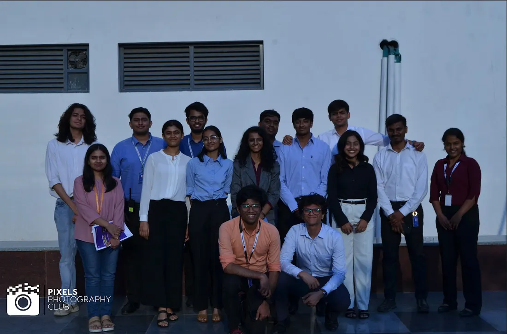

# VLSI DAY 2025 — Exploring the Future Beyond AI

The world of semiconductors is evolving rapidly, with advancements shaping the future of computing, communications, and AI. As we move beyond the AI revolution, what lies ahead for silicon technology? This question is at the heart of **VLSI DAY 2025**, the flagship event organized by **SILICON**, the dedicated VLSI tech forum under the Department of Electronics & Communication Engineering, PES University (RR Campus).

As a member of the technical domain in **SILICON** since my third semester, and currently in my fourth semester, I have witnessed firsthand how this forum brings together VLSI enthusiasts to learn, collaborate, and innovate. This year, I was also part of the **volunteer team**, assisting in **event registrations, securing permissions, and ensuring smooth operations** leading up to the event.

VLSI DAY 2025, held on **March 8, 2025**, was a remarkable event where industry pioneers, esteemed academicians, and alumni came together to discuss the next big wave in semiconductor technology.

## **Theme: Silicon — What Next After AI?**

This year’s theme focused on the **next frontier beyond AI**, covering groundbreaking advancements in architectural design, computing, security, and the broader impact of AI on semiconductor technology. The event aimed to address key challenges and opportunities, fostering discussions on how VLSI will shape the technological landscape in the post-AI era.

## **Distinguished Speakers**

The event featured an impressive lineup of industry leaders, researchers, and academicians, each offering unique insights into the world of semiconductors. Here’s a look at our distinguished speakers:

## **Dr. Satya Gupta — President, VLSI Society of India**

A semiconductor industry veteran, Dr. Gupta has played pivotal roles at **Intel, Open Silicon, Concept2Silicon Systems (acquired by HCL Technologies)**, and **IESA**. As the chief guest, he provided a visionary outlook on the role of VLSI in driving technological transformation.

## **Ms. Malini Narayanamoorthi — Country Head, Renesas India**

With over 20 years in the semiconductor industry, Ms. Malini leads **Renesas India** and has extensive experience in **mixed-signal product development**. Her passion for **diversity and women in technology** added a crucial dimension to the discussions.

## **Mr. Gaurav Goel — Senior Principal Engineer, Renesas Electronics**

An expert in **memory I/O and high-speed DDR PHYs**, Mr. Goel shared insights from his experience at **Intel, AMD, and Synopsys**, highlighting emerging trends in data transmission and low dropout regulators.

## **Dr. Jaidev Shenoy — Senior Staff Manager, Marvell Semiconductors**

With a PhD in VLSI from IIT Bombay, Dr. Shenoy’s expertise spans **Design for Testability (DFT) and multi-site testing of ICs**. His session delved into innovations in chip testing and verification.

## **Dr. Utsav Banerjee — Assistant Professor, IISc**

Leading the **SINESys research group**, Dr. Banerjee specializes in **cryptography, hardware security, and embedded systems**. His talk explored **secure silicon design methodologies** for the next generation of processors.

## **Dr. Govinda Rao Locharla — Staff Design Engineer, Western Digital**

An expert in **RTL design**, Dr. Locharla’s session covered **fixed-width signed multipliers and efficient data compaction techniques** used in cutting-edge storage technologies.

## **Dr. Viveka K R — Assistant Professor, IISc**

Specializing in **ultra-low-power VLSI circuits and in-memory computing**, Dr. Viveka discussed how **energy-efficient semiconductor architectures** will drive future computing paradigms.

## **Dr. Anand Mukhopadhyay — Senior Engineer, MathWorks**

With expertise in **neuromorphic computing and Spiking Neural Networks (SNNs)**, Dr. Mukhopadhyay shared his research on **energy-efficient architectures** for AI-driven semiconductor applications.

## **Panel Discussion: Alumni Insights**

A highlight of VLSI DAY 2025 was the **panel discussion featuring PES University alumni**, who shared their experiences and insights into the evolving semiconductor industry. Their journeys from university projects to industry innovations provided valuable takeaways for students aspiring to make their mark in VLSI.

VLSI DAY 2025 was an eye-opening experience, offering a deep dive into the future of semiconductor technology beyond AI. The discussions, insights, and networking opportunities reinforced the importance of continuous learning and innovation in VLSI.

As a **SILICON** club member, I am excited to be part of this growing community that nurtures curiosity and fosters expertise in VLSI. With each event, we move one step closer to shaping the future of semiconductors, pushing the boundaries of what’s possible in the post-AI era.

Here’s to another year of innovation, collaboration, and breakthroughs in VLSI!