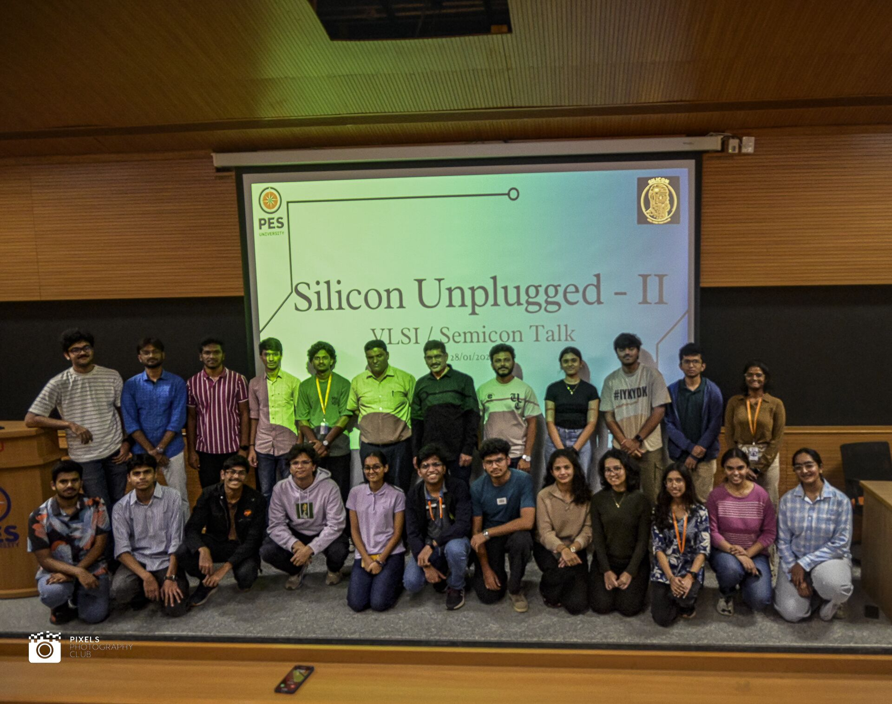

# Inside Silicon Unplugged: Conversations That Shaped Our Perspective

As a member of **Silicon**, the VLSI vertical of the ECE department, it has been exciting to be part of organizing the **Silicon Unplugged** talk series and witnessing the enthusiasm it generated among students. The series concluded successfully with three insightful sessions that brought together industry leaders and academia to share their perspectives on semiconductors, VLSI, AI hardware, and engineering careers. Beyond the technical discussions, the sessions offered invaluable lessons on curiosity, systems thinking, and lifelong learning. This blog captures some of the key takeaways from the inaugural AMA session that left a lasting impression on me.

The insightful **panel AMA session** brought together veterans from the semiconductor and systems industry to discuss careers, technology inflection points, and the mindset required to grow into system-level architects and technical leaders , especially in the era of **AI-driven hardware**.

The discussion was candid, experience-driven, and deeply reassuring for students and early-career engineers navigating a rapidly evolving industry.

## **The Panel**

## **Speakers**

- **Kuldeep Simha**With over 30 years of experience in VLSI, server microprocessor design, and SoC/IP leadership, Kuldeep has been directly involved in the tape-out and productization of multiple generations of Intel’s Itanium and Xeon server processors. His experience spans front-end, back-end, clocking, memory, power, customer engagement, and building large engineering teams.

- **Radhakrishnan Mahalikudi**A seasoned leader with 30+ years in the industry, Radhakrishnan has managed 150+ member engineering teams, led processor verification programs, and worked across processor, memory subsystem, and SoC architectures, while also focusing heavily on people growth and leadership development.

## **Moderators**

- **Sathya Prasad**With three decades of global experience (including 20 years at Intel’s Datacenter Group), Sathya has led strategic product planning, product management, and R&D for server products. He has also played a foundational role in building Intel India’s server division, SEMI India, and academic innovation ecosystems.

**Sudeendra Kumar K**

Bringing an academic and systems perspective, Prof. Sudeendra added balance to the discussion by connecting industry realities with long-term thinking and fundamentals.

## **1. From Engineer to System-Level Architect: What Really Matters?**

One of the most important questions addressed was: **What differentiates engineers who grow into system architects and technical leaders?**

**Kuldeep Simha** emphasized that architecture is not just about depth, but about *breadth with purpose*:

- Strong **technical expertise** is foundational, but not sufficient.
- Architects must make **strategic contributions**, not just local optimizations.
- **Mentoring** and knowledge sharing are key responsibilities.
- A system architect needs **end-to-end global knowledge and an** understanding which domains truly impact the system.
- The ability to **bridge domains** (hardware, software, power, memory, packaging) is critical.
- Most importantly: *never hesitate to raise your hand and take on complex, ambiguous challenges.*

A powerful reminder came through his statement: *“We don’t have all the answers.”* What differentiates great engineers is not knowing everything, but continuously **growing through deliberate effort**. It’s not about hours spent, but whether your knowledge meaningfully compounds over time.

**Prof. Sudeendra** summarized it succinctly:

> *“Master of one, jack of all.”*
> 

He also highlighted the importance of intuition and being able to sense the **future trajectory of your company and its competitors**, not just today’s technical problems.

## **2. Is Hardware–Software Co-Design Still Important? (Yes — Non-Negotiable)**

On the topic of **hardware–software co-design**, there was strong consensus.

**Radhakrishnan** spoke about finding the *“sweet spot”* — where hardware capabilities and software abstractions reinforce each other rather than working in silos.

**Kuldeep** was blunt: *hardware–software co-design is non-negotiable.*

**Sathya Prasad** illustrated this with a relatable analogy — comparing system optimization to adapting a Honda Civic for Indian roads. The product only succeeds when design decisions are informed by real-world usage. His advice to students was clear:

**Take computer science courses**, even if your core identity is hardware.

## **3. AI Acceleration: Fabrication or Architecture — Where Is Innovation Happening?**

With AI pushing compute demands to extremes, the panel explored where innovation is happening faster.

**Kuldeep** pointed out that we are increasingly **hitting the limits of physics**:

- Transitioning from FinFETs to **Gate-All-Around (GAA)** structures
- The rise of **commodity chips** optimized for scale rather than raw novelty

**Prof. Sudeendra** added an economic lens:

- Moore’s Law, in its classical sense, is effectively done.
- We are already pushing physical limits.
- Innovation and returns are increasingly driven by **high bandwidth memory**, packaging, and system-level optimizations rather than transistor scaling alone.