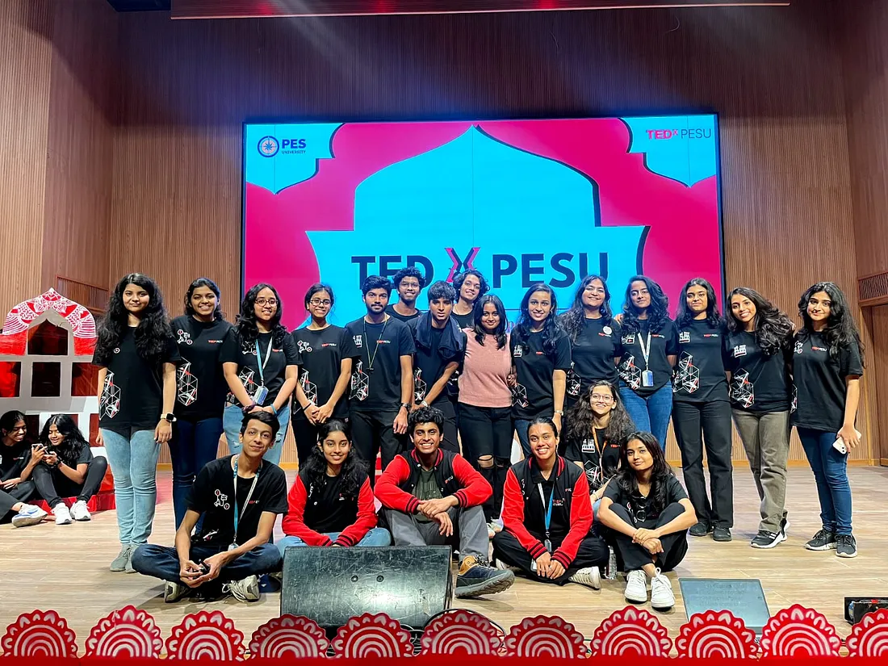

# Behind the Scenes of TEDx PESU 2023: A Volunteer’s Journey

Organizing a large-scale event like TEDx is no small feat, and being part of the production team for **TEDx PESU 2023** gave me a firsthand understanding of how such events come together. With the theme “**The Indian Tapestry of Thought**,” TEDx PESU promised to deliver captivating talks from some of India’s brightest minds, and I was honoured to contribute as an event production volunteer.

## **What is a TEDx Event?**

TEDx is a global initiative inspired by TED’s guiding principles — **technology, entertainment, and design** — that drive conversations shaping our world today. TEDx events are organized by local volunteers who aim to share **“ideas worth spreading”** in their own communities. These events feature live talks and recorded TED talks, giving attendees a chance to engage with cutting-edge research, new ideas, and inspiring stories.

**TEDx PESU 2023** was no different. It was an independently organized event that sought to showcase a diverse array of perspectives under the theme “The Indian Tapestry of Thought.” The event, scheduled for the **4th of November, 2024** , promised an evening filled with thought-provoking talks, ideas, and connections.

## **Spotlight on the Speakers**

The lineup for TEDx PESU 2023 was impressive, bringing together some of India’s leading thinkers and innovators. The speakers included:

- **Captain Martina George**: An Indian Air Force Veteran and the Founder and CEO of KNIO INFOTECH, she brings a wealth of experience from her time in the defense forces and her entrepreneurial ventures.

- **Nikitha C**: The co-founder of SSERD & GENEX SPACE, Nikitha is a driving force in space research and education, inspiring young minds to explore new frontiers.

• **Dr. Bhagwan Chowdhry**: A Professor of Finance at the Indian School of Business (ISB) and Research Professor at UCLA Anderson School, Dr. Chowdhry’s research spans finance and economics with a global impact.

• **M.D. Pallavi**: A renowned Kannada Sugama Sangeetha singer and television actor, Pallavi has left her mark on India’s cultural scene with her soulful voice and acting talent.

- **Srividya Varchaswi:** This speaker is **a** true embodiment of versatility. She’s not just an artist, director, and choreographer but also the visionary leader behind the lifestyle brand, BYOGI, a life coach and a meditation teacher, having conducted workshops and programs across the world.With the launch of “Jhankriti,” she’s created a platform for budding classical music and dance talents to shine. She also directed the dance drama “The Cosmic Rhythm,” uniting 30 dance forms and 4600 performers from 45 countries.

• **Samir Jolly:** A relentless advocate for change and a champion of the underprivileged, Samir’s life reflects an incredible odyssey across the landscapes of service, spirituality, and societal reconciliation.

## **Spotlight on the Artistes**

- **Team Sankskrithi** : Sanskrithi is the Indian Contemporary Dance Club of PES University. They had graced us with an immaculate dance performance on the day of the event.

**Tarana** : Tarana is a semi classical fusion band. They had put together an invigorating musical performance.

## **My Role as an Event Production Volunteer**

As a volunteer for the production team, my responsibilities spanned both the preparatory phase and the event day itself. Here’s how my journey unfolded:

**Pre-Event Preparations :**

In the weeks leading up to TEDx PESU, I helped **promote** the event by going **class to class**, engaging in one-on-one conversations with students. I explained the significance of TEDx, answered queries from people who had never attended such an event, and generated enthusiasm across campus.

In addition to personal outreach, the volunteer team was responsible for putting up **posters** around campus to ensure everyone was aware of the event and its significance. I also helped curate social media promotion in the form of ‘**Instagram Reels**’. The excitement was palpable, but many students were unfamiliar with TEDx, so part of my role was also to familiarize them with what to expect.

**The Day of the Event:**

On the day of TEDx PESU 2023, the tasks grew more hands-on. From early morning, we set up the venue and arranged **memento bags** for the attendees. The venue was located in our new block, which was partly under construction and had a labyrinth-like layout. To avoid confusion, I, along with my fellow volunteers, stuck directional arrows from the entrance to the auditorium, guiding attendees to their seats.

I also assisted in managing the registration desk, ensuring that the attendees were checked in smoothly and directed to their seats without any hassle. This required close attention to detail and quick thinking, especially as the venue was hosting multiple events that day. With three other student clubs hosting events on campus, it was vital to ensure our TEDx attendees knew exactly where to go.

Later in the day, I helped procure lunch from the vendor, coordinated the delivery to the cafeteria, and assisted in serving lunch to attendees. With a large crowd to manage, ensuring a smooth lunch service without creating long queues was challenging, but teamwork and quick decision-making helped avoid bottlenecks.

## **Overcoming Challenges**

Like any major event, TEDx PESU 2023 was not without its challenges, but these moments taught me valuable lessons in adaptability and resourcefulness:

1. Sticker Shortage for Memento Bags:

We faced an unforeseen shortage of ‘TEDx PESU’ stickers for the memento bags early in the morning. The store that had supplied the stickers was closed, so we had to find a new shop in a nearby alley, explain our requirements, and get them printed on the spot. The urgency of the situation required us to remain calm and solution-oriented, which ultimately paid off.

2. Competing Events on Campus:

With several events happening simultaneously, it was crucial to direct TEDx PESU attendees clearly to our venue. We had to ensure there was no confusion, especially for those unfamiliar with the new building layout.

3. Adapting to Work Culture:

As a freshman at the university, I was new to the work culture of both the TEDx club and the college. I had to quickly adjust to the team dynamics and learn how to contribute effectively. It was a crash course in working with new people, understanding the structure of event planning, and communicating in a professional environment.

4. Managing the Lunch Queue:

Serving lunch efficiently to avoid long queues and keep the event on schedule was challenging. We had to be quick, organized, and mindful of time to ensure that attendees were well-fed without disrupting the flow of the event.

## **Lessons Learned**

Being part of TEDx PESU 2023 was an eye-opening experience. It wasn’t just about managing an event — it was about learning how to think on your feet, work in a dynamic team, and handle unexpected hurdles. Here’s what I took away from the experience:

- Event Management: I gained a deep understanding of how to organize and manage large-scale events, including logistical details and team coordination.
- **Setting Up Processes**: Establishing clear processes for tasks — whether it’s managing registration or serving lunch — ensured smooth operations.
- **Adaptability**: From the sticker shortage to the crowded lunch hour, I learned how to manage last-minute challenges without losing my cool.
- **Working in Teams**: I collaborated with individuals I had never met before and learned how to function effectively as part of a diverse team.
- **Time Management**: Efficient time management was crucial, particularly during lunch service, to keep the event on track and avoid delays.

## **Conclusion**

Volunteering for TEDx PESU 2023 taught me invaluable lessons about teamwork, event management, and problem-solving. It was an intense, fulfilling experience that has given me the confidence to tackle future challenges with the knowledge that I can adapt, organize, and deliver when it matters most. If you ever get the chance to be a part of something like TEDx, I highly recommend taking it — you’ll walk away with far more than just memories.