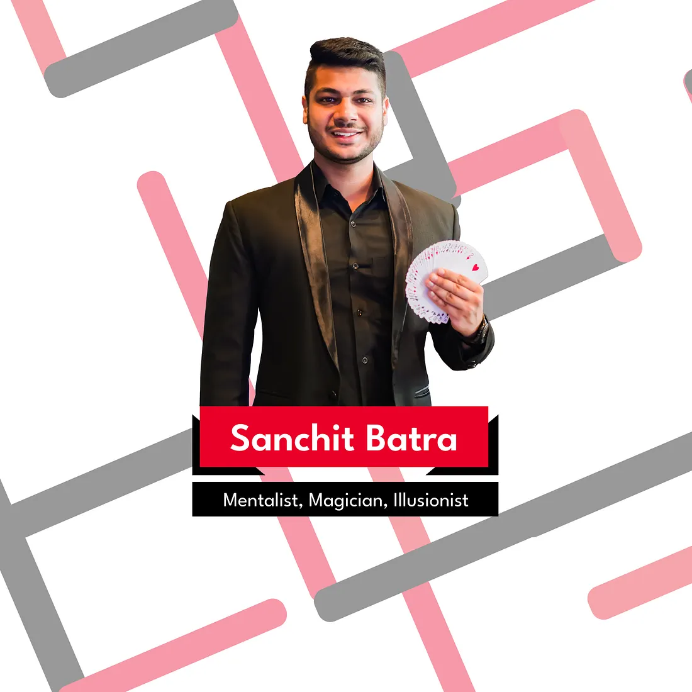

# TEDxPESU 2024: Mosaics of Modernity — A Journey in Event Production

## **A Glimpse into TEDx Events**

TEDx events are independently organized platforms that embody TED’s spirit of “ideas worth spreading.” These local gatherings unite thought leaders, innovators, and visionaries to spark engaging discussions that transcend disciplines. TEDxPESU 2024 was no exception, bringing together an extraordinary lineup of speakers under the theme **Mosaics of Modernity.**

## **TEDxPESU 2024: A Celebration of Ideas**

Held on **November 9, 2024**, TEDxPESU 2024 showcased some of the brightest minds from diverse backgrounds. Each speaker brought a unique perspective, contributing to a vibrant mosaic of modern thought:

**Sanchit Batra**:

Sanchit Batra, an award-winning entertainer, is renowned for his dynamic blend of comedy, psychology, and mentalism. Named the Funniest Comic Magician in Singapore in 2018, his versatile performances have garnered attention on major platforms like Hotstar, NDTV, and News24, enhancing his reputation beyond just live audiences. He has established himself in the industry with his engaging and captivating style, making a significant impact on audiences everywhere.Excelling in the fusion of digital technology and classic illusions, he crafts interactive shows that push the boundaries of traditional magic. This innovative approach captivates viewers and ensures that each performance is a memorable experience. With over a decade in the industry, he is a sought-after “Celebrity Choice” performer at corporate events and exclusive gatherings.Sanchit’s journey to becoming an acclaimed professional magician reflects his unwavering

**Aditi Arya:**

Aditi Arya Kotak, crowned Miss India 2015, is a Yale alumnus and co-founder of Alum-n-i, a platform dedicated to helping students expand their perspectives through global education. She has worked as an analyst in one of the big four audit firms, Ernst & Young. She has also worked with non profit organisations such as Amitasha, Supported Decision Making, and Protsahan.Her journey reflects her persistence and commitment to growth and empowerment, as she strives to make international education more accessible for aspiring students. Her work spans across fields, from education to women empowerment. Her passion for personal development extends beyond all of her work as well; she also hosts her own self improvement called “Aryatic”, where she shares strategies for self refinement and personal well being.Aditi’s varied career as a mentor, entrepreneur, and digital creator makes her an ideal role model for hopeful young professionals and students. Her work continues to inspire people to pursue their ambitions with confidence, embodying her core values of growth, determination, and positive impact.dedication to his craft. His shows, distinguished by interactivity, clever humour, and digital flair, continue to inspire both audiences and aspiring magicians, showcasing the exciting possibilities of modern magic while evolving the art itself.

**Pradyun P Rao:**

Pradyun is a 21y/o 4th year student at PES University Electronic City where they teach Computer Science Engineering, but lots of his learning happens outside the classroom.He’s been entrepreneurial from his 1st sem of college, from writing content and “selling milk” to building web apps and fine tuning LLMs, he’s done it all. He participated and won his first hackathon in the 3rd sem, launched an ecommerce business in the 4th sem, and by the 5th sem led a team of 10 to build the Salaar Fan Army experience for Hombale Films, a movie promotional campaign that saw 2M+ site visitors and was featured by 200+ media publications.Now, he’s on a course committee for entrepreneurship at IIM Bangalore and has started hosting a podcast there. He continues to build projects, give ‘fundas’ and credits the people around him for everything he’s done. He loves cooking, ASKing questions and analyzing movie plots.

**Swathi Vellal:**

Swathi Vellal Raghunandan is the Founder Director of Ishanya India Foundation, a non-profit in Bangalore dedicated to empowering Persons with Disabilities through assistive technology and inclusive education. With a Master’s in Special Educational Needs from the University of Northampton and in Clinical Psychology from Christ University, she brings deep expertise to her work, focusing on autism inclusion and support for both individuals and families. Her journey reflects a commitment to empathy and empowerment, working closely with parents and caregivers on various aspects of disability care. Swathi has also supported workplace inclusion by collaborating with organisations to help transition individuals with autism into employment. Additionally, she has hosted several podcasts on mental health. Swathi’s contributions extend beyond direct service. She has published research, presented at international forums, and received numerous accolades, including the MTC Global Award and the 2024 Amarnath Rajanahally Inclusion Award — a testament to her dedication to building an inclusive society.

**Sudiptaa Paul Choudhury:**

Sudiptaa Paul Choudhury stands out as a dynamic force in marketing, growth, and innovation. As Chief Marketing & Growth Officer at Shorter Loop and an Independent Director (loD), she expertly navigates the intersection of marketing, growth, and corporate governance. She provides invaluable insights across multiple boards, guiding organisations through the intricacies of digital transformation. Her dedication to positive change extends beyond the corporate realm. As a staunch advocate of Diversity, Equity, and Inclusion (DEI), she masterfully blends these ideas in her career as a corporate and career mentor. She also brings her expertise in global brand leadership, marketing, and career mentorship to every endeavour. Her volunteer work includes contributions with The Akshaya Patra Foundation, where she donated books and supported health and education initiatives for underprivileged students. She also served as a Fundraising Coordinator for the Treeveni Foundation, advocating for human rights. Sudiptaa’s career is marked by numerous accolades, like her recognition as one of the Global Marketing Leaders of 2023 by the Global Marketing Leaders Report and as a Top 10 Marketer of 2022 by CEOInsights Global Magazine. She was also named “Women Executive of the Year” in 2021 by ET NOW and embodies leadership that drives both corporate and social spheres, inspiring mentees and peers alike.

**Nikhil Narendran:**

Nikhil Narendran focuses on the interplay of technology, law, commerce and human lives. Nikhil Narendran is a Partner at Trilegal’s specializing in Al, technology, media, and telecom (TMT) law. With extensive experience, he guides both established companies and startups through India’s complex tech landscape, advising on market strategies and regulatory compliance. As an Al law expert, Nikhil addresses legal challenges related to ethics, data protection, and compliance frameworks while also assisting businesses in Fintech, e-commerce, and telecom with their digital transformations. Internationally, Nikhil has worked on technology policy in Nepal, Sri Lanka, and Bangladesh and contributed to commercial negotiations across South-East Asia, Europe, and America. He was recognized with the prestigious ITechLaw Travelling Fellowship Award in 2011. He is currently the President of Center for Internet and Society and treasurer of International Technology Law Association.

Each talk offered fresh insights into how modernity is shaping our world, making for an intellectually stimulating experience.

## **My Role: From Volunteer to Head of Event Production**

TEDxPESU 2024 was not just an event I attended — it was an event I helped bring to life. As **Head of Event Production**, I led a dynamic team of students spanning engineering, design, psychology, and commerce. My journey began in 2023 as a volunteer, and in my second year of undergrad, I took on the immense responsibility of ensuring a seamless event experience.

### **The Backbone of TEDx: Event Production**

Event production is the unseen force that ensures TEDx events unfold flawlessly. My responsibilities encompassed both pre-event planning and real-time execution on the day of the event.

**Pre-Event Planning:**

- Overseeing smooth registration processes for attendees.
- Coordinating food arrangements while balancing budget and quality.
- Curating attendee goodie kits and arranging speaker mementos.
- Securing necessary permissions from university management.
- Managing infrastructure needs to create an immersive experience.

**On the Day of the Event:**

- Ensuring a seamless hospitality experience for speakers and attendees.
- Supervising the auditorium setup and overall logistics.
- Overcoming last-minute challenges with adaptability and problem-solving.

## **Reflections: Lessons from TEDxPESU 2024**

Being at the helm of event production was an exhilarating experience that tested my leadership, coordination, and problem-solving skills. I learned the importance of teamwork, quick decision-making, and meticulous planning. More than anything, I saw how an event like TEDx can ignite meaningful conversations, inspire change, and leave a lasting impact on attendees.

As I move forward in my university journey, TEDxPESU 2024 remains a milestone — a testament to the power of collaboration, creativity, and determination. If there’s one key takeaway, it’s that organizing an event of this scale is not just about logistics; it’s about crafting an experience that stays with people long after the stage lights dim.

Here’s to many more transformative experiences ahead!

