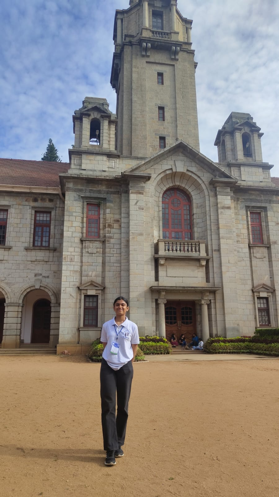

# Day 2 of Summer School- 2025 by Dept. of Electrical Engineering IISC

The second day of the research school was a fascinating mix of engineering, artificial intelligence, computer vision, power electronics, and perhaps most importantly, conversations about what it actually means to do research. From touring one of India's premier High Voltage Laboratories to hearing faculty share decades of experience, the day constantly reminded me how broad and interconnected engineering research has become.

## A Visit to the High Voltage Laboratory

The day began with a visit to the High Voltage Laboratory (HVL), one of the highlights of the event. Often referred to as the "mother of all High Voltage Labs" in India, the facility houses equipment designed to test high-voltage electrical apparatus under extreme conditions.

Some of the impressive infrastructure included:

- A **250 kV DC testing system**
- **Three transformers connected in cascade**
- A massive **impulse generator**
- A **350 kV setup** for high-voltage experimentation

Beyond power system testing, it was interesting to learn about the laboratory's work in **plasma applications**, such as VLSI etching and even agricultural applications like seed treatment. It was a reminder that high-voltage engineering extends far beyond transmission lines.

---

## Demystifying the Black Box: Explainability and Trust in AI

Prof. **Sriram Ganapathy** delivered an excellent talk on one of AI's biggest challenges - **understanding why models make the decisions they do**.

He began with simple but powerful examples illustrating how AI models can inherit hidden biases, such as the classic "doctor" and "nurse" stereotype. These examples immediately established why explainability is becoming increasingly important as AI systems enter critical domains.

The talk revolved around the idea of moving from:

**Input → Black Box Model → Output**

towards systems where the reasoning behind predictions can also be understood.

Two interesting frameworks discussed were:

- **DAX (Distillation Aided Explainability)** — learning interpretable explanations for otherwise opaque models.
- **FESTA (Functionally Equivalent Sampling for Trust Assessment)** — a framework aimed at evaluating trust by generating functionally equivalent and complementary samples.

Another key concept was **attribution-based explainability**, where models identify which parts of an input contribute most strongly to a prediction. Saliency maps are one such example, highlighting the regions that matter most.

One takeaway that stayed with me was that explainability itself can often become a learning problem, where another model is trained to interpret the original one.

---

## Understanding Uncertainty in Large Language Models

The first student talk focused on **uncertainty estimation in Large Language Models**.

While LLMs are remarkably capable, they remain vulnerable to:

- Hallucinations
- Domain shifts
- Modality-dependent behaviour

The presentation introduced FESTA from the perspective of trust assessment, using equivalent and complementary sample generators to probe model behaviour.

Evaluation relied on metrics such as **AUROC (Area Under the Receiver Operating Characteristic Curve)**, providing quantitative insight into how reliably uncertainty estimates distinguish between correct and incorrect predictions.

The discussion reinforced an important idea: accuracy alone is not enough. Future AI systems must also know when they might be wrong.

---

## Aircraft Lightning, Smart Grids and Neuromorphic Imaging

The subsequent student presentations showcased the diversity of ongoing research.

One explored **aircraft-initiated lightning** and the electromagnetic fields generated during such events - a topic that combines atmospheric physics with electromagnetic engineering.

Another focused on **cyber-physical vulnerability assessment for smart grids**, highlighting how modern power networks increasingly require expertise spanning electrical engineering, cybersecurity, and system modelling.

The final talk introduced **High-Dynamic-Range imaging within the Neuromorphic Unlimited Sampling Framework**, demonstrating how inspiration from biological sensing continues to influence next-generation imaging systems.

---

## Designing Inverters for Grid and EV Applications

After lunch, Dr. **Samir Hazra** delivered a tutorial on inverter design principles for both grid-connected systems and electric vehicles.

The session emphasised high-level design philosophies rather than circuit-level implementation, helping connect theoretical power electronics with practical industrial applications.

---

## Computer Vision at a Glance

Prof. **Soma Biswas** presented a broad overview of computer vision, making it one of the most information-rich sessions of the day.

She began by introducing the major tasks in computer vision:

- Image classification
- Object detection
- Image segmentation
- Image generation

She then discussed the challenges that make vision difficult:

- Position variation
- Background clutter
- Scale changes
- Occlusion
- Motion blur
- Intra-class variation

The talk traced the evolution of vision systems from traditional pipelines—

> preprocessing → handcrafted feature extraction (HOG, SIFT) → feature selection → classifiers like SVMs
> 

—to modern deep learning approaches built around Convolutional Neural Networks.

An especially interesting section focused on today's emerging research directions:

- Continual and incremental learning
- Novel class discovery
- Catastrophic forgetting
- Domain adaptation
- Cross-modal learning

Models such as **CLIP (Contrastive Language-Image Pre-training)** illustrate how vision and language can be jointly understood, while diffusion transformers are opening new possibilities for personalised generative AI.

The session also briefly touched upon speech signals, reminding us that multimodal AI extends beyond images. Speech signals are time-varying, quasi-periodic, non-stationary, information-rich, and typically sampled between **8–16 kHz**, with common formats including WAV, PCM, and MP3.

---

## Faculty Panel: What Research Really Means

The faculty panel turned out to be one of the most memorable parts of the day—not because of technical content, but because of the perspectives shared.

Several recurring themes emerged.

### Passion matters—but so does perseverance

Prof. Shastry emphasised that aptitude alone is insufficient. Research demands **tenacity and grit**, especially when progress is slow.

### Academia resembles entrepreneurship

Prof. Narayanan drew an interesting comparison:

> Academia is, in many ways, similar to entrepreneurship.
> 

Researchers seek funding much like entrepreneurs raise capital, define their own agendas, and navigate uncertainties while pursuing long-term goals.

### Learning versus research

Perhaps the most thought-provoking idea was the distinction between learning and research.

Something only needs to be **new to you** for learning to happen.

Research begins when very few people are exploring the problem.

Novelty therefore doesn't necessarily mean discovering something entirely unprecedented—it means contributing something meaningful within the existing body of knowledge.

An ecosystem of experts helps determine whether an idea is genuinely novel.

### Control the process, not the outcome

Another insightful observation was:

> The output is not entirely under your control. The process is.
> 

Good research focuses on improving inputs, discipline, and methodology rather than obsessing over outcomes.

### Organic innovation

Prof. Santhi encouraged students not to judge themselves too harshly when beginning research.

Creating something new often starts with reorganising existing knowledge. Incremental understanding naturally leads to original ideas over time.

Prof. Tapas Roy reflected on his journey from industry to academia, motivated by a desire to contribute to society, while Prof. Muthuvel highlighted the importance of maintaining a lifelong passion for learning.

---

## Final Thoughts

The day moved seamlessly across electrical engineering, artificial intelligence, computer vision, power electronics, and research philosophy.

What connected all these seemingly different sessions was a common theme: engineering today is becoming increasingly interdisciplinary, and success depends not just on technical expertise but also on curiosity, trust, and persistence.

The technical talks introduced cutting-edge research from explainable AI to neuromorphic imaging and smart grids but it was the faculty panel that left the deepest impression. Research is not merely about producing novel results; it is a continuous process of learning, questioning, refining ideas, and patiently contributing to a much larger body of knowledge.

By the end of the day, I came away with a clearer understanding that good research is less about chasing breakthroughs and more about consistently asking better questions.
