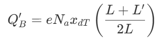

# Second Order Effects in MOSFETS: Short-Channel Effects (SCE)

When we first study MOSFETs, we treat the channel length (*L*) as a simple geometric scaling factor. We assume that the electric fields behave neatly in one dimension and that the gate exerts absolute, dictatorial control over the channel.

However, when we shrink *L* down to the deep submicron and nanometer regimes (like 40 nm or less), the source and drain terminals become so intimately close that they begin to interfere with the gate's electrostatics. The one-dimensional math elegantly breaks down, giving rise to a family of incredibly fascinating phenomena known as **Short-Channel Effects (SCE)**.

The major short channel effects are as follows:

### 1. Threshold Voltage Roll-Off

Imagine you have to pay a toll to cross a bridge, but two of your very wealthy friends have already chipped in and paid a large portion of it for you. Naturally, the remaining amount you have to pay is much lower.

This is the exact intuition behind **Threshold Voltage Roll-Off**, one of the most critical short-channel effects in modern transistor design! The gate is you, the source and drain are your wealthy friends, and the threshold voltage (*VTH*) is the toll.

**The Physical Mechanism: "Charge Sharing"**

In a classical, long-channel MOSFET, we assume the gate has absolute, 100% responsibility for turning the transistor on. To create the conductive inversion layer, the gate must first repel the majority carriers and uncover a rectangular block of immobile bulk depletion charge (*QB*) in the substrate.

However, the heavily doped source and drain terminals have their own built-in, reverse-biased depletion regions that naturally extend into the channel area. In a long-channel device, these regions are negligibly small compared to the vast channel length. But as the channel length (*L*) shrinks down to the nanometer regime, these source and drain depletion regions protrude considerably into the gate's territory.

Because the source and drain are now "sharing" the burden of depleting the substrate, a large portion of the immobile bulk charge is electrostatically imaged (supported) by the source and drain rather than by the gate. Because the gate has a smaller amount of bulk charge left to deplete, the gate voltage required to turn the device on decreases. As *L* gets smaller, *VTH* "rolls off" to lower and lower values!

**The Mathematical Elegance: The Trapezoidal Model**

We can model this brilliantly using a geometric approach called the Yau Charge-Sharing Model.

Instead of the gate controlling a perfect rectangle of bulk charge, the intrusion of the source and drain depletion regions means the gate is only responsible for a **trapezoidal** region of charge.

Let the bottom of the trapezoid be the metallurgical channel length *L*, and the top of the trapezoid be *L*′. The average bulk charge per unit area, *QB*′, in this trapezoid is mathematically defined as:

where *e* is the elementary charge, *N_a* is the substrate doping concentration, and *x_dT* is the maximum space charge (depletion) width at the threshold inversion point.

By applying a bit of trigonometry and assuming the source and drain junctions have a lateral diffusion depth of *r_j*, we can solve for the geometric ratio of the trapezoid:

Now comes the ultimate payoff. The shift in the threshold voltage (Δ*V_TH*) is strictly dictated by the difference between this new trapezoidal charge and the old rectangular charge, divided by the gate oxide capacitance (*C_ox*). When we combine the equations, the resulting shift in the threshold voltage is:

**Why This Equation is a Designer's Blueprint**

Look closely at the mathematics of the Δ*V_TH* equation; it tells us exactly how to design better transistors!

1. **The Minus Sign:** The equation is strictly negative, mathematically proving that as the device shrinks, the threshold voltage actively drops.
2. **The** 1/*L* **Dependence:** The channel length *L* is in the denominator. As *L* shrinks into the deep submicron regime, the *r_j*/*L* fraction explodes, causing a severe drop in the threshold voltage that can prevent the transistor from ever fully turning off.
3. **The Role of Junction Depth (***r_j***):** To fight this roll-off, the equation shows us we must minimize *r_j*. This perfectly explains why modern semiconductor fabrication spends billions of dollars developing "ultra-shallow junctions" because making *r_j* smaller dramatically reduces the threshold voltage's dependence on the channel length.

## 2. Drain-Induced Barrier Lowering (DIBL)

**The Intuitive Picture: The Dam and the Waterfall**

 Imagine a massive reservoir of water (representing the source electrons) held back by a thick, tall concrete dam (the potential barrier). The gate is the dam operator; applying a gate voltage lowers the dam, allowing water to flow into the river below (the drain).

If the river is miles away (a classical long-channel device), whatever happens down the river has absolutely no effect on the dam. But what if we shrink the distance so the river is right up against the base of the dam? If the river drops into a massive, steep waterfall (a high drain voltage), the sheer electrostatic "suction" of that drop physically erodes the thickness and height of the dam itself! The water starts spilling over exponentially, even if the gate operator didn't touch the controls.

**The Electrostatic Physics**

 Let's look at the rigorous device physics. In weak inversion, raising the gate voltage increases the surface potential, drawing charge carriers from the source. However, as the channel length becomes microscopic, the heavily doped drain terminal is brought incredibly close to the source.

When a large drain-to-source voltage (*VDS*) is applied, it creates a powerful two-dimensional electric field in the depletion region. This field penetrates the channel and allows the drain's space charge region to directly interact with the source's space charge region.

**The Mathematical Reality** 

We can model this electrostatic intrusion by recognizing that the drain introduces a parasitic capacitance, *Cd*′, which raises the surface potential in the exact same manner as the gate's depletion capacitance does. The drain is effectively "stealing" control of the channel from the gate!

Because the potential barrier separating the source and the channel is physically lowered by the drain's electric field, and because subthreshold current is strictly an *exponential* function of that barrier height, the drain current shoots up very rapidly as *VDS* increases.

Mathematically, this means your threshold voltage (*VTH*) actively decreases as a function of the drain voltage.

](../assets/sce_blog/image%203.png)

[https://youtu.be/SjxVE0oZlL4?si=ywIk_Pmxq1b4Rjvz](https://youtu.be/SjxVE0oZlL4?si=ywIk_Pmxq1b4Rjvz)

**Near Punch-Through and Circuit Impact**

Because the drain is aggressively pulling down the barrier, DIBL is formally recognized as a "near punch-through" condition. If the barrier were to be completely eliminated, the drain and source depletion regions would literally touch, resulting in massive, uncontrolled current (actual punch-through).

For a circuit designer, DIBL is a tragedy. Ideally, in the saturation region, the drain current should remain perfectly flat and independent of *VDS*, giving the transistor an infinite output impedance. But because DIBL causes the current to continuously slope upward with *VDS*, it severely degrades the transistor's small-signal output impedance (*ro*).

This graph is showing that **increasing drain voltage from 0.1 V to 1.5 V shifts the entire I_D-V_G curve to lower gate voltages, meaning the threshold voltage decreases by ΔVth. That decrease in threshold voltage is the drain-induced barrier lowering (DIBL).**

The arrow labeled ΔVth measures the horizontal shift between the two curves.

References:

1. https://ieeexplore.ieee.org/document/4588186
2. https://www.iue.tuwien.ac.at/phd/stockinger/node15.html
3. [https://youtu.be/SjxVE0oZlL4?si=I_TgOGi_JqYl9Q5z](https://youtu.be/SjxVE0oZlL4?si=I_TgOGi_JqYl9Q5z)
4. [https://youtu.be/SjxVE0oZlL4?si=I_TgOGi_JqYl9Q5z](https://youtu.be/SjxVE0oZlL4?si=I_TgOGi_JqYl9Q5z)

## Difference between DIBL and voltage roll off

The golden rule to separate them in your mind is this: **Roll-Off is a static, geometric effect** driven by the channel length (*L*), whereas **DIBL is a dynamic, electrostatic effect** driven by the drain voltage (*V_DS*).

**1. Threshold Voltage Roll-Off: The Geometric Reality**

**The Intuition:** Imagine you are lifting a heavy box (depleting the bulk charge to turn the transistor on). If the box is very long (a classical long-channel device), you do all the lifting yourself. But if we chop the box down to a very short length, your two friends (the source and drain) are now standing close enough to grab the edges of the box and help you lift. Because they are helping, you don't have to pull as hard.

**The Physics:** *VTH* Roll-off is strictly a consequence of shrinking the physical channel length *L*. In the classical model, the gate is responsible for depleting a rectangular block of bulk charge. However, the source and drain terminals have their own built-in, reverse-biased depletion regions that naturally extend into the channel area. As *L* shrinks, these source and drain depletion regions merge into the gate's territory, meaning they physically "share" the burden of depleting the bulk charge.

**The Mathematics:** Because the gate has to deplete a smaller, trapezoidal region of charge rather than a full rectangle, the threshold voltage drops. This shift, Δ*V_TH*, is roughly proportional to −*r_j/L*, where *rj* is the junction depth. Notice that this happens even if the drain voltage is zero or very small! It is purely a function of the device's physical dimensions and the built-in potentials.

**2. DIBL: The Electrostatic Intrusion**

**The Intuition:** Imagine a dam holding back a reservoir of water (the source electrons). The gate is the dam operator, controlling the height. Now, imagine a massive waterfall forms right on the other side of the dam (a high drain voltage). The sheer electrostatic "suction" of that waterfall reaches back and physically erodes the top of the dam, letting water spill over even if the operator didn't touch the controls!

**The Physics:** DIBL is a "near punch-through" condition caused specifically by applying a large drain-to-source voltage (*VDS*). When a large *VDS* is applied to a short-channel device, it creates a powerful two-dimensional electric field. This field penetrates the channel and allows the drain's space charge region to directly interact with the source's space charge region, actively pulling down the potential barrier at the source.

**The Mathematics:** In a long-channel device, the drain voltage has zero influence on the source barrier. But in a short-channel device experiencing DIBL, the threshold voltage becomes a direct function of *VDS*. As *VDS* increases, *VTH* actively decreases. Because subthreshold current is an exponential function of this barrier height, DIBL causes the drain current to shoot up rapidly as *VDS* increases, brutally degrading the transistor's output impedance.

**The Master Summary**

- *VTH* **Roll-Off** answers the question: *"How much does the threshold voltage drop just by fabricating the transistor shorter?"* (It is an unavoidable function of the geometry, namely *L* and *rj*).
- **DIBL** answers the question: *"How much does the threshold voltage drop when I apply a high voltage to the drain?"* (It is an active electrostatic intrusion that scales with *VDS*).
    
    
    | Feature | DIBL | Threshold Voltage Roll-Off |
    | --- | --- | --- |
    | Primary cause | Increase in drain voltage | Reduction in channel length |
    | What changes? | Threshold voltage changes with drain bias | Threshold voltage changes with device geometry |
    | Nature | Bias-dependent effect | Structural/device-dimension effect |
    | Measurement | ( \Delta V_{th}/\Delta V_D ) | ( V_{th} ) vs. channel length (L) |
    | Occurs because | Drain electric field penetrates toward source | Source and drain depletion regions encroach into channel |
    | Main consequence | Increased OFF-state leakage at high drain voltage | Lower threshold voltage as devices are scaled down |

### 3.  Subthreshold leakage

Imagine a heavy, steel floodgate designed to hold back a massive reservoir of water (the electrons in your source terminal). When you fully crank the gate open (*VGS*>*VTH*), water violently rushes through to the other side (the drain)—this is our strong inversion region. But what happens when you shut the gate completely (*VGS*=0)? In an ideal, mathematically perfect world, the flow of water drops absolutely to zero.

In physical reality, however, the gate does not form a perfectly watertight seal. Even when the gate is "closed," a tiny, steady trickle of water continuously seeps underneath it. This electrical seepage is exactly what we call **Subthreshold Leakage**!

Let's break down the mechanics, the beautiful mathematics, and exactly why this leakage is exponentially increasing in modern nanoscale NMOS devices.

**1. What Exactly is Subthreshold Conduction?**

In the classical square-law models we first learn, we pretend that if the gate-to-source voltage (*VGS*) drops below the threshold voltage (*VTH*), the drain current (*ID*) drops to absolutely zero.

However, in reality, when *VGS*<*VTH*, the transistor does not abruptly turn off. Instead, the silicon surface just below the oxide enters a state called **weak inversion**. A small, finite current continues to flow from the drain to the source.

**2. Why Does It Occur? (The Shift to Diffusion)**

To understand *why* this happens, we must completely shift our physical intuition. When a transistor is turned firmly "on" (strong inversion), the current is driven by **drift**—a powerful electric field actively sweeping a dense channel of electrons from the source to the drain.

But in the subthreshold (weak inversion) regime, the carrier density is very small, and the lateral electric field across the channel is virtually nonexistent. Instead, the transport mechanism beautifully shifts from drift to **diffusion**.

Because there is a potential barrier separating the heavily doped *n*+ source from the *p*-type channel, electrons must rely purely on their own kinetic thermal energy to "hop" over this barrier. Once they overcome the barrier, they slowly diffuse across the channel concentration gradient toward the drain.

**3. How Does It Occur? (The Mathematical Elegance)**

Because this process relies entirely on the thermal energy of the electrons, the mathematics perfectly mirror the classical Boltzmann distribution. As you lower the gate voltage, you are effectively raising the height of the potential barrier, which exponentially chokes off the diffusion current.

We can model this subthreshold drain current rigorously as: *ID*=*I*0exp(*ξVTVGS*) where *VT*=*kT*/*e* is the thermal voltage (about 26 mV at room temperature), *I*0 is a proportionality factor depending on the device dimensions (*W*/*L*), and *ξ* is a nonideality factor greater than 1.

To quantify how well a transistor turns off, we use a brilliant parameter called the **subthreshold slope** (*S*). It tells us exactly how much we must decrease *VGS* to drop the current by one decade (a factor of 10). It is elegantly defined as: *S*=2.3*VT*(1+*CoxCd*) V/decade where *Cd* is the depletion capacitance and *Cox* is the oxide capacitance. In an absolutely perfect device at room temperature, this slope is about 60 mV/decade, but in practical physical devices, it is typically around 80 to 100 mV/decade.

**4. Why is Subthreshold Leakage *Increasing*?**

This brings us to the core of your question: why is this leakage becoming such a massive problem in modern NMOS devices?

It all comes down to scaling. As we shrink the channel length (*L*) of our transistors down to the deep submicron regime (like 40 nm or less), the drain terminal is brought extremely close to the source. When we apply a positive voltage to the drain, its electric field easily penetrates all the way across the tiny channel and electrostatically interacts with the source.

This electrostatic intrusion actively pulls down the potential barrier that is supposed to be holding the source electrons back—a notorious short-channel effect known as **Drain-Induced Barrier Lowering (DIBL)**.

Because our subthreshold current equation is strictly *exponential* with respect to the barrier height, even a tiny drop in the barrier caused by DIBL translates into a catastrophic, exponential increase in the leakage current. Furthermore, to maintain acceptable switching speeds as we scale down the supply voltage (*VDD*), we are forced to scale down the threshold voltage (*VTH*). Because 0 V is now mathematically much closer to *VTH*, the baseline exponential leakage is immensely higher.

**The Grand Consequence**

If you have a single transistor, a leakage current of a few nanoamperes might seem entirely negligible. But if you design a modern microprocessor with hundreds of millions or even billions of transistors, and they are all leaking an exponentially increased subthreshold current while sitting in the "off" state (*VGS*=0), those nanoamperes multiply into amperes. This leads to massive static power dissipation, generating intense heat and rapidly draining battery life.

This graph shows two transfer characteristics with different threshold voltages. The curve shifted to the left has a lower threshold voltage, turns on earlier, and produces higher leakage current at low V_GS. In short-channel MOSFETs, this leftward shift is commonly caused by DIBL.

Sources:

1. [https://pages.cs.wisc.edu/~arch/www/ISCA-2000-panel/T.N.Vijaykumar/sld003.htm](https://pages.cs.wisc.edu/~arch/www/ISCA-2000-panel/T.N.Vijaykumar/sld003.htm)
2. Design of Analog CMOS Integrated Circuit, by Behzad Razavi

### 4. Velocity Saturation:

Imagine a skydiver jumping out of an airplane. Gravity pulls them down, causing them to accelerate faster and faster, but eventually, the frictional force of the air pushing back balances the pull of gravity, and they reach a strict terminal velocity. In the wondrous world of semiconductor physics, electrons are our skydivers, the electric field is gravity, and the microscopic silicon lattice is the atmosphere!

This is the perfect intuition for **Velocity Saturation**, a phenomenon that completely rewrites the calculus of our transistors when we shrink them down to the short-channel regime. Let us break down the physics and the beautiful mathematics of what happens.

**The Classical Model (The Low-Field World)** In classical physics, the drift velocity of an electron (*vd*) is directly proportional to the applied electric field (E). We connect the two elegantly using the electron mobility (*μn*), giving us the linear relationship: *vd*=*μn*E. If you push harder with the electric field, the electron moves proportionally faster.

**The Short-Channel Reality (The Speed Limit)** As we aggressively shrink the channel length (*L*) of an NMOS transistor down to the nanometer regime, the lateral electric field—which is roughly *VDS*/*L*—becomes absolutely colossal. When the electric field exceeds a critical threshold of approximately 104 V/cm (or 1 V/*μ*m), the linear mobility rule breaks down.

The electrons are driven so hard that they collide violently with the vibrating atoms of the crystal lattice, dumping their energy. Because of this intense scattering, the electrons simply cannot accelerate any further and reach an absolute "terminal speed" known as the saturation velocity (*vsat*). For electrons in silicon, this universal speed limit is approximately 107 cm/s.

When the velocity of our carriers "hits a wall," it drastically alters three fundamental I-V characteristics of the NMOS transistor:

**1. Premature Saturation** In a long-channel device, the drain current ideally saturates when the channel pinches off at *VDS*=*VGS*−*VTH*. However, because the electrons hit their absolute speed limit so early in a short-channel device, the drain current reaches its maximum value prematurely. Saturation now occurs well before the physical pinch-off point, meaning the transistor enters the saturation region at a much lower *VDS* than classical models predict.

**2. The Mathematical Shift to Linearity** Since steady-state current is fundamentally the product of charge density and velocity, locking the velocity at *vsat* transforms the transistor's identity. The famous parabolic, square-law equation for the saturated drain current collapses into a strictly **linear** function of the overdrive voltage. The new mathematical reality is: *ID*=*WCox*(*VGS*−*VTH*)*vsat* Look at how beautiful this equation is! Because velocity saturation dictates the current, the dependence on the channel length (*L*) entirely vanishes from the formula.

**3. Transconductance Flatlines** Transconductance (*gm*) measures the "gain" or sensitivity of the transistor—how effectively a change in gate voltage alters the drain current. If we take the derivative of our new linear current equation with respect to *VGS*, the overdrive voltage drops out, leaving us with: *gm*=*WCoxvsat* This reveals a harsh reality for circuit designers: the transconductance is now a constant, maximum value. No matter how much harder you drive the gate voltage, you cannot squeeze any more transconductance out of the device.

Sources:

1. Advanced Semiconductor Fundamentals, Second Edition, by Robert F. Pierret 
2. Semiconductor physics and devices, by Donald A. Neamen
3. Design of Analog CMOS Integrated Circuits, by Behzad Razavi
4. [https://youtu.be/rpGi-RKso8Y](https://youtu.be/rpGi-RKso8Y) 
    
    ### 5. Hot Carrier Effects (HCE)
    
    **The Intuitive Picture: The Exploding Tennis Ball** Imagine rolling a tennis ball down a smooth hallway. It reaches a maximum terminal speed due to air resistance. But suddenly, near the very end of the hallway, a massive vacuum sucks the ball forward with terrifying force. The ball accelerates to such an extreme kinetic energy that when it finally strikes the wall, it doesn’t just bounce—it shatters the wall, embeds fragments of itself into the plaster, and blasts other chunks of debris backward!
    
    
    
    This is exactly what happens in a short-channel NMOS transistor. The tennis ball is an electron, the vacuum is the massive electric field near the drain, and the wall is the delicate silicon lattice and gate oxide. Let us break down the physical mechanics and the beautiful, yet destructive, mathematics of **Hot Carrier Effects (HCE)**.
    
    **1. What Makes an Electron "Hot"?**
    
    As we shrink the channel length (*L*) of an NMOS device while maintaining a relatively high drain-to-source voltage (*VDS*), the lateral electric field near the drain terminal becomes absolutely colossal.
    
    While the *average* drift velocity of the electrons saturates at around 107 cm/s due to phonon scattering, the *instantaneous* velocity and kinetic energy of individual electrons in the high-energy tail of the distribution function continue to increase violently as they accelerate toward the drain.
    
    In physics, we relate the kinetic energy of a particle to an effective temperature (*E*=23*kTc*). Because these specific electrons acquire kinetic energies between 1.5 eV and 4.0 eV, their effective carrier temperature (*Tc*) skyrockets to tens of thousands of degrees Kelvin. They are physically out of thermal equilibrium with the silicon lattice, earning them the title of **"hot" electrons**.
    
    **2. Consequence One: Impact Ionization (The Avalanche)**
    
    When these hot electrons smash into the silicon atoms near the drain at such extreme speeds, they trigger a phenomenon called **impact ionization**.
    
    The kinetic energy of the hot electron is transferred to a valence-band electron in the silicon lattice, violently knocking it loose and elevating it into the conduction band. This single collision generates a brand new electron-hole pair.
    
    - The newly generated electrons are quickly absorbed by the positive drain terminal.
    - The newly generated holes, however, are repelled by the positive drain and swept downward into the p-type substrate.
    
    **The Mathematical & Circuit Impact:** This flow of holes into the substrate creates a measurable, parasitic drain-to-substrate current (*I_sub*). For circuit designers, *I_sub* is the ultimate warning siren; it is the primary monitor and indicator that hot-electron degradation is occurring within the device.
    
    **3. Consequence Two: Oxide Injection (The Trap)**
    
    If a hot electron acquires enough energy, its path becomes even more destructive. The potential barrier separating the silicon channel from the silicon dioxide (*SiO_*2) gate dielectric is approximately 3.1 eV.
    
    If an electron's kinetic energy exceeds this barrier, it can physically overcome the boundary and be injected directly into the gate oxide. Once inside the oxide, a fraction of these hot electrons become permanently trapped in the dielectric lattice.
    
    **The Mathematical & Circuit Impact:** Because electrons carry a negative charge, embedding them into the oxide produces a net negative charge density (*Q_ox*) right above the channel. To turn the NMOS transistor on, the gate must now apply a *higher* positive voltage just to cancel out this trapped negative charge. This causes a permanent, local **positive shift in the threshold voltage (**Δ*V_TH***)**.
    
    **4. Consequence Three: Interface Degradation (The Aging Transistor)**
    
    The final and most damaging consequence of hot electrons involves the atomic chemistry of the *Si*−*SiO_*2 interface.
    
    During fabrication, the interface is deliberately annealed with hydrogen to bond with "dangling" silicon atoms (forming passive Si-H bonds) and smooth out the electrical surface. However, when hot electrons collide with the interface, their immense kinetic energy literally breaks these delicate Si-H bonds, releasing the hydrogen and re-exposing the dangling silicon bonds.
    
    **The Mathematical & Circuit Impact:** These newly formed dangling bonds act as active interface trap states. They wreak havoc on the transistor in two ways:
    
    1. **More Threshold Shifting:** They trap additional charge, causing *V_TH* to shift even further over time.
    2. **Mobility Degradation:** The physical roughness of the broken bonds drastically increases surface scattering. This severely degrades the electron mobility (*μn*), which in turn crushes the transconductance (*gm*) and current-drive capability of the device.
    
    **The Grand Conclusion**
    
    Hot Carrier Effects are the fundamental mechanism of **transistor aging**. As the device operates, the constant bombardment of hot electrons steadily increases the threshold voltage and destroys the carrier mobility until the transistor simply fails to meet its timing or current specifications.
    
    ### 6.  Punch through
    
    Imagine two massive reservoirs of water (representing the heavily doped *n*+ source and drain regions) separated by a thick, sturdy earthen dam (the *p*-type substrate channel). Normally, the gate acts as the operator on top of the dam, carefully lowering a gate to let water flow over the surface. But what if the pressure from the downstream reservoir (the drain voltage) becomes so immense that it physically erodes the earth *inside* the dam, digging a tunnel that eventually connects straight through to the upstream reservoir? The dam is breached, the water rushes through uncontrollably, and the operator on top is rendered utterly powerless.
    
    
    
    This catastrophic subsurface breach is exactly what we call **punch-through** in a MOSFET! Let's break down the mechanics and the beautiful electrostatics behind it.
    
    **1. The Physical Mechanism**
    
    In an NMOS transistor, both the heavily doped source and drain form *pn* junctions with the *p*-type substrate. Naturally, both of these junctions have built-in space-charge (depletion) regions extending into the channel.
    
    When you apply a positive drain-to-source voltage (*VDS*), the drain-to-substrate junction becomes heavily reverse-biased. As *VDS* increases, the depletion region around the drain physically widens and extends laterally deeper into the channel.
    
    If the metallurgical channel length *L* is extremely short, an excessively large *VDS* will force the drain's depletion region to expand so far that it physically touches the depletion region surrounding the source. This is the exact condition of punch-through.
    
    **2. The Mathematical Elegance (Predicting the Breach)**
    
    As engineers, we do not just describe failure; we predict it mathematically! We can rigorously calculate the exact voltage required to trigger this event using the abrupt junction approximation.
    
    Let *x_d*0 be the depletion width extending from the grounded source, and let
    
    *x_d*  be the reverse-biased depletion width extending from the drain. From Poisson's equation, they are defined by the substrate doping concentration *N_a* and the built-in potential *V_bi*:
    
    [](data:image/svg+xml;utf8,<svg xmlns="http://www.w3.org/2000/svg" width="400em" height="3.08em" viewBox="0 0 400000 3240" preserveAspectRatio="xMinYMin slice"><path d="M473,2793%0Ac339.3,-1799.3,509.3,-2700,510,-2702 l0 -0%0Ac3.3,-7.3,9.3,-11,18,-11 H400000v40H1017.7%0As-90.5,478,-276.2,1466c-185.7,988,-279.5,1483,-281.5,1485c-2,6,-10,9,-24,9%0Ac-8,0,-12,-0.7,-12,-2c0,-1.3,-5.3,-32,-16,-92c-50.7,-293.3,-119.7,-693.3,-207,-1200%0Ac0,-1.3,-5.3,8.7,-16,30c-10.7,21.3,-21.3,42.7,-32,64s-16,33,-16,33s-26,-26,-26,-26%0As76,-153,76,-153s77,-151,77,-151c0.7,0.7,35.7,202,105,604c67.3,400.7,102,602.7,104,%0A606zM1001 80h400000v40H1017.7z"></path></svg>)
    
    
    
    Punch-through is mathematically defined as the exact moment when the sum of these two space-charge widths perfectly equals the physical channel length *L*: 
    
    *xd_*0+*x_d*=*L*
    
    We can algebraically rearrange this boundary condition to solve for the exact **punch-through voltage** (*V_DS*(*pt*)). 
    
    First, isolate *x_d*: *x_d*=*L*−*x_d*0
    
    Square both sides and substitute our equation for *xd*:
    
    
    
    Finally, solving for *VDS*(*pt*) yields: 
    
    
    
    Look at this beautiful equation! It tells us that to increase the punch-through voltage (and make our transistor more robust), we must either increase the channel length *L* or increase the substrate doping *Na* to prevent the depletion regions from expanding so easily.
    
    **3. The Catastrophic Consequence**
    
    When the two depletion regions physically merge, the electrostatic potential barrier that normally separates the source and the drain is completely eliminated.
    
    Because the barrier vanishes deep within the bulk of the silicon—far away from the oxide interface—the gate voltage loses absolutely all control over the channel. Electrons from the source are violently swept directly into the drain by the massive electric field, creating an enormous, uncontrolled drain current. In practical integrated circuits, this massive surge of current acts as a short circuit and can permanently damage the transistor.
    
    **4. The DIBL Connection (The Warning Sign)**
    
    This perfectly contextualizes our previous discussion on Drain-Induced Barrier Lowering (DIBL). As the two space-charge regions get close to one another, they begin to electrostatically interact before they even touch.
    
    This interaction causes the drain current to increase rapidly *before* the theoretical punch-through condition is actually reached. Therefore, DIBL is formally classified as a **"near punch-through"** condition. DIBL is the warning sign (the barrier eroding), while punch-through is the ultimate failure (the barrier collapsing).
