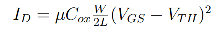

# 2nd order effects

# CLM

Imagine you are riding a water slide that drops off into a deep pool. The water (electrons) flows down the slide (the transistor channel) and eventually drops off the edge (the pinch-off point) into the pool (the drain). In an ideal world, the length of the slide is perfectly fixed. But what if making the pool deeper actually eroded the edge of the slide, pulling the drop-off point closer to you and making the slide *shorter*?

That is exactly the intuition behind **channel length modulation**!

### The Physical Mechanism

In an ideal MOSFET, when the drain-to-source voltage (V_DS) increases to a critical point called the saturation voltage (V_DS(sat)), the inversion layer of electrons "pinches off" at the drain end. Ideally, any further increase in V_{DS} shouldn't change the current, because the channel is fully saturated.

However, in reality, as V_DS continues to increase beyond V_DS(sat), the reverse-biased depletion region at the drain terminal widens and extends *laterally* into the channel. By eating into the channel, this widening depletion region physically moves the pinch-off point closer to the source, effectively decreasing the active length of the channel.

### The Mathematical Elegance

Let’s look at the beautiful mathematics behind this. If the original metallurgical channel length is L, the lateral expansion of the depletion region shortens it by a small amount, which we will call Δ L. The new, effective channel length becomes L' = L - Δ L.

Because the drain current I_D is inversely proportional to the channel length (I_D ∝ 1/L), shrinking the channel causes the current to *increase*. We can state this rigorously by relating the actual modulated drain current, I_D', to the ideal drain current, I_D:

Because Δ L is a function of the drain voltage  V_DS, the current I_D' is no longer a flat constant in the saturation region; it grows as V_DS grows. To make this mathematically convenient for circuit designers, we use a Taylor series approximation and introduce \lambda, the **channel length modulation parameter**. We can now elegantly express the current in the saturation region as:

### Why This Matters for Performance

In our ideal model, the slope of the I_D versus V_{DS} curve in the saturation region is perfectly flat (zero slope), which implies the transistor has an *infinite* output resistance.

But because of channel length modulation, the current gradually slopes upward. This positive slope gives our transistor a finite, measurable small-signal output resistance (r_o), which we find by taking the inverse derivative of the current with respect to the drain voltage:

As we push the limits of technology and fabricate progressively smaller, short-channel devices, Δ L becomes a much larger and more significant fraction of the original length L. Because of this, channel length modulation becomes a severe bottleneck in modern nanoscale VLSI design, lowering the transistor's output resistance and thereby reducing the maximum voltage gain the device can provide.

## **How CLM Affects the *I_D* vs. *V_GS* Graph**

Let's quickly resurrect our water slide analogy! Channel Length Modulation (CLM) occurs when a high drain-to-source voltage (*V_DS*) creates a large reverse bias at the drain junction, causing the depletion region to extend laterally into the channel. This physically erodes the "drop-off" of our slide, shrinking the effective channel length by an amount Δ*L*

To see how this alters the *I_D*  vs. *V_GS* curve, we must look at the mathematical blueprint. In an ideal MOSFET biased in the saturation region, the drain current strictly follows a square-law relationship with the gate-to-source voltage:

where *kn*′ is the process conduction parameter, *W* is width, and *L* is the original channel length. Plotted out, this forms a perfect parabola.

However, because the drain current is inversely proportional to the channel length, shrinking the channel to *L*−Δ*L* forces the actual drain current (*ID*′) to increase. We use the channel length modulation parameter, *λ*, to elegantly write this as:

where the term (1+*λV_DS*) mathematically accounts for the shortened channel.

For any given *V_GS*  beyond the threshold voltage (*V_T*), the device yields a higher current than the ideal equation predicts. The larger your applied *V_DS*, the higher and slightly steeper this *V_GS* parabola will appear.

References:

1. Semiconductor Physics and Devices, by Donald A. Neamen
2. Semiconductor Device Physics and Design, by Umesh K_ Mishra, Jasprit Singh 
3. [https://user.eng.umd.edu/~neil/enee313/MOSFET_current.pdf](https://user.eng.umd.edu/~neil/enee313/MOSFET_current.pdf)
4. [https://www.slideshare.net/slideshow/channel-length-modulation-251960754/251960754](https://www.slideshare.net/slideshow/channel-length-modulation-251960754/251960754)

# Body effect

Imagine you are trying to lift a heavy metallic door using a powerful electromagnet. Normally, it takes a certain amount of magnetic force to open it. But what if someone sneaks into the basement and attaches thick bungee cords to the bottom of the door, pulling it downwards? Suddenly, your electromagnet has to pull *much* harder to lift that exact same door.

This is the exact intuition behind the **Body Effect** (also known as the substrate bias effect) in MOSFETs!

## **The Physical Mechanism**

In standard MOSFET analysis, we usually assume the substrate (or body) and the source are connected to the same ground potential, making the source-to-body voltage *V_SB*=0. However, in many integrated circuit configurations, the source and body are not at the same potential.

When we apply a reverse-bias voltage between the source and the substrate (*V_SB*>0), we are effectively pulling on those "bungee cords". This reverse bias forces the space charge (depletion) region in the substrate to widen. In a standard n-channel device, the surface normally inverts to form the channel when the surface potential *ϕs* reaches 2*ϕfp*. But with *V_SB*>0, the newly created inversion electrons are at a higher potential energy than the electrons in the source. To actually form the channel and allow conduction, the surface potential must be pushed even higher to overcome this extra energy barrier, specifically requiring 

*ϕ_s*=2*ϕ_fp*+*V_SB*

Because the depletion region is now wider, the gate must supply additional positive charge to compensate for the increased negative space charge of the uncovered acceptor ions. The ultimate result? It takes a higher gate voltage to turn the transistor on.

## **The Mathematical Elegance**

Let's express this beautifully in mathematical terms. To reach the new threshold condition, the change in the required gate voltage (Δ*VT*) directly correlates to the change in the space charge density (Δ*Q_SD*′).

By evaluating the charge in the widened depletion region, we can rigorously define the shift in the threshold voltage as: 

Here, we introduce *γ*, which is formally defined as the **body-effect coefficient:**

[](data:image/svg+xml;utf8,<svg xmlns="http://www.w3.org/2000/svg" width="400em" height="1.28em" viewBox="0 0 400000 1296" preserveAspectRatio="xMinYMin slice"><path d="M263,681c0.7,0,18,39.7,52,119%0Ac34,79.3,68.167,158.7,102.5,238c34.3,79.3,51.8,119.3,52.5,120%0Ac340,-704.7,510.7,-1060.3,512,-1067%0Al0 -0%0Ac4.7,-7.3,11,-11,19,-11%0AH40000v40H1012.3%0As-271.3,567,-271.3,567c-38.7,80.7,-84,175,-136,283c-52,108,-89.167,185.3,-111.5,232%0Ac-22.3,46.7,-33.8,70.3,-34.5,71c-4.7,4.7,-12.3,7,-23,7s-12,-1,-12,-1%0As-109,-253,-109,-253c-72.7,-168,-109.3,-252,-110,-252c-10.7,8,-22,16.7,-34,26%0Ac-22,17.3,-33.3,26,-34,26s-26,-26,-26,-26s76,-59,76,-59s76,-60,76,-60z%0AM1001 80h400000v40h-400000z"></path></svg>)

[](data:image/svg+xml;utf8,<svg xmlns="http://www.w3.org/2000/svg" width="400em" height="1.28em" viewBox="0 0 400000 1296" preserveAspectRatio="xMinYMin slice"><path d="M263,681c0.7,0,18,39.7,52,119%0Ac34,79.3,68.167,158.7,102.5,238c34.3,79.3,51.8,119.3,52.5,120%0Ac340,-704.7,510.7,-1060.3,512,-1067%0Al0 -0%0Ac4.7,-7.3,11,-11,19,-11%0AH40000v40H1012.3%0As-271.3,567,-271.3,567c-38.7,80.7,-84,175,-136,283c-52,108,-89.167,185.3,-111.5,232%0Ac-22.3,46.7,-33.8,70.3,-34.5,71c-4.7,4.7,-12.3,7,-23,7s-12,-1,-12,-1%0As-109,-253,-109,-253c-72.7,-168,-109.3,-252,-110,-252c-10.7,8,-22,16.7,-34,26%0Ac-22,17.3,-33.3,26,-34,26s-26,-26,-26,-26s76,-59,76,-59s76,-60,76,-60z%0AM1001 80h400000v40h-400000z"></path></svg>)

In this elegant parameter, *e* is the elementary charge, *ϵ_s* is the semiconductor's permittivity, *N_a* is the substrate's acceptor doping concentration, and *C_ox* is the oxide capacitance per unit area.

As you can see from the mathematics, Δ*V_T* is always positive for an n-channel device, meaning the threshold voltage will inevitably increase as a function of the source-to-body junction voltage.

## **How body effect affects the *I_D* vs. *V_GS g*raph**

Remember our heavy metallic door with the bungee cords pulling it down from our previous discussion? Because the body effect (applying a reverse-bias source-to-body voltage,*V_SB*>0) effectively adds more "bungee cords," it takes a much higher gate voltage just to crack the door open, meaning the threshold voltage (*V_T*) increases

Now, let's look at exactly how this mathematically and physically strangles the flow of electrons - our drain current (*I_D*) - across the I-V characteristics!

To understand the I-V changes, you only need to look at the term (*V_GS*−*V_T*). This term is the "driving force" or "overdrive voltage" of the transistor. Because the body effect increases *V_T*, the value of (*V_GS*−*V_T*) inevitably shrinks for any fixed gate voltage. Here is how that alters the three main pieces of the I-V graph:

**1. The Nonsaturation (Linear) Region**

When the drain-to-source voltage (*V_DS*) is small, the transistor acts like a voltage-controlled resistor. The mathematically elegant equation for the drain current in this region is:

Because our *V_T* parameter has increased due to the body effect, the (*V_GS*−*V_T*) multiplier becomes smaller. Physically, this means the inversion layer is less densely packed with electrons, so the channel's initial conductance drops. Graphically, the initial slope of the *I_D* versus *V_DS* curve becomes much flatter.

**2. The Saturation Region** When we push the transistor into saturation, the current is supposed to level off to a maximum value. The beautiful square-law equation governing this is: 

Because the drain current here relies on the

*square* of (*V_GS*−*V_T*), the body effect brutally punishes the saturation current. An increase in

*V_T* from the body effect causes the total saturation current to drop quadratically. If you were to plot the *I_D*(*sat*) versus *V_GS*, applying a *V_SB* shifts the entire straight-line curve to the right, pointing to the new, higher threshold voltage.

**3. The Pinch-Off Point (***V_DS*(*sat*)**)**

The body effect also changes *when* the transistor saturates. The drain voltage required to pinch off the channel at the drain terminal is given by:

[](data:image/svg+xml;utf8,<svg xmlns="http://www.w3.org/2000/svg" width="400em" height="1.28em" viewBox="0 0 400000 1296" preserveAspectRatio="xMinYMin slice"><path d="M263,681c0.7,0,18,39.7,52,119%0Ac34,79.3,68.167,158.7,102.5,238c34.3,79.3,51.8,119.3,52.5,120%0Ac340,-704.7,510.7,-1060.3,512,-1067%0Al0 -0%0Ac4.7,-7.3,11,-11,19,-11%0AH40000v40H1012.3%0As-271.3,567,-271.3,567c-38.7,80.7,-84,175,-136,283c-52,108,-89.167,185.3,-111.5,232%0Ac-22.3,46.7,-33.8,70.3,-34.5,71c-4.7,4.7,-12.3,7,-23,7s-12,-1,-12,-1%0As-109,-253,-109,-253c-72.7,-168,-109.3,-252,-110,-252c-10.7,8,-22,16.7,-34,26%0Ac-22,17.3,-33.3,26,-34,26s-26,-26,-26,-26s76,-59,76,-59s76,-60,76,-60z%0AM1001 80h400000v40h-400000z"></path></svg>)

Since *V_T*  is larger, *V_DS*(*sat*) becomes smaller. This means the transistor channel pinches off earlier, entering the saturation region at a lower drain voltage than it normally would.

**The Big Picture View**

If you look at the classic *I_D*  versus *V_DS* graph, turning on the body effect effectively "squashes" the entire family of curves downwards. For the exact same gate voltage, your transistor provides less channel conductance, pinches off earlier, and yields a severely reduced maximum current.

# Short-channel effects (SCE)

When we first study MOSFETs, we treat the channel length (*L*) as a simple geometric scaling factor. We assume that the electric fields behave neatly in one dimension and that the gate exerts absolute, dictatorial control over the channel.

However, when we shrink *L* down to the deep submicron and nanometer regimes (like 40 nm or less), the source and drain terminals become so intimately close that they begin to interfere with the gate's electrostatics. The one-dimensional math elegantly breaks down, giving rise to a family of incredibly fascinating phenomena known as **Short-Channel Effects (SCE)**.

The major short channel effects are as follows:

### 1. Threshold Voltage Roll-Off

Imagine you have to pay a toll to cross a bridge, but two of your very wealthy friends have already chipped in and paid a large portion of it for you. Naturally, the remaining amount you have to pay is much lower.

This is the exact intuition behind **Threshold Voltage Roll-Off**, one of the most critical short-channel effects in modern transistor design! The gate is you, the source and drain are your wealthy friends, and the threshold voltage (*VTH*) is the toll.

**The Physical Mechanism: "Charge Sharing"**

In a classical, long-channel MOSFET, we assume the gate has absolute, 100% responsibility for turning the transistor on. To create the conductive inversion layer, the gate must first repel the majority carriers and uncover a rectangular block of immobile bulk depletion charge (*QB*) in the substrate.

However, the heavily doped source and drain terminals have their own built-in, reverse-biased depletion regions that naturally extend into the channel area. In a long-channel device, these regions are negligibly small compared to the vast channel length. But as the channel length (*L*) shrinks down to the nanometer regime, these source and drain depletion regions protrude considerably into the gate's territory.

Because the source and drain are now "sharing" the burden of depleting the substrate, a large portion of the immobile bulk charge is electrostatically imaged (supported) by the source and drain rather than by the gate. Because the gate has a smaller amount of bulk charge left to deplete, the gate voltage required to turn the device on decreases. As *L* gets smaller, *VTH* "rolls off" to lower and lower values!

**The Mathematical Elegance: The Trapezoidal Model**

We can model this brilliantly using a geometric approach called the Yau Charge-Sharing Model.

Instead of the gate controlling a perfect rectangle of bulk charge, the intrusion of the source and drain depletion regions means the gate is only responsible for a **trapezoidal** region of charge.

Let the bottom of the trapezoid be the metallurgical channel length *L*, and the top of the trapezoid be *L*′. The average bulk charge per unit area, *QB*′, in this trapezoid is mathematically defined as:

where *e* is the elementary charge, *N_a* is the substrate doping concentration, and *x_dT* is the maximum space charge (depletion) width at the threshold inversion point.

By applying a bit of trigonometry and assuming the source and drain junctions have a lateral diffusion depth of *r_j*, we can solve for the geometric ratio of the trapezoid:

Now comes the ultimate payoff. The shift in the threshold voltage (Δ*V_TH*) is strictly dictated by the difference between this new trapezoidal charge and the old rectangular charge, divided by the gate oxide capacitance (*C_ox*). When we combine the equations, the resulting shift in the threshold voltage is:

**Why This Equation is a Designer's Blueprint**

Look closely at the mathematics of the Δ*V_TH* equation; it tells us exactly how to design better transistors!

1. **The Minus Sign:** The equation is strictly negative, mathematically proving that as the device shrinks, the threshold voltage actively drops.
2. **The** 1/*L* **Dependence:** The channel length *L* is in the denominator. As *L* shrinks into the deep submicron regime, the *r_j*/*L* fraction explodes, causing a severe drop in the threshold voltage that can prevent the transistor from ever fully turning off.
3. **The Role of Junction Depth (***r_j***):** To fight this roll-off, the equation shows us we must minimize *r_j*. This perfectly explains why modern semiconductor fabrication spends billions of dollars developing "ultra-shallow junctions" because making *r_j* smaller dramatically reduces the threshold voltage's dependence on the channel length.

## 2. Drain-Induced Barrier Lowering (DIBL)

**The Intuitive Picture: The Dam and the Waterfall**

 Imagine a massive reservoir of water (representing the source electrons) held back by a thick, tall concrete dam (the potential barrier). The gate is the dam operator; applying a gate voltage lowers the dam, allowing water to flow into the river below (the drain).

If the river is miles away (a classical long-channel device), whatever happens down the river has absolutely no effect on the dam. But what if we shrink the distance so the river is right up against the base of the dam? If the river drops into a massive, steep waterfall (a high drain voltage), the sheer electrostatic "suction" of that drop physically erodes the thickness and height of the dam itself! The water starts spilling over exponentially, even if the gate operator didn't touch the controls.

**The Electrostatic Physics**

 Let's look at the rigorous device physics. In weak inversion, raising the gate voltage increases the surface potential, drawing charge carriers from the source. However, as the channel length becomes microscopic, the heavily doped drain terminal is brought incredibly close to the source.

When a large drain-to-source voltage (*VDS*) is applied, it creates a powerful two-dimensional electric field in the depletion region. This field penetrates the channel and allows the drain's space charge region to directly interact with the source's space charge region.

**The Mathematical Reality** 

We can model this electrostatic intrusion by recognizing that the drain introduces a parasitic capacitance, *Cd*′, which raises the surface potential in the exact same manner as the gate's depletion capacitance does. The drain is effectively "stealing" control of the channel from the gate!

Because the potential barrier separating the source and the channel is physically lowered by the drain's electric field, and because subthreshold current is strictly an *exponential* function of that barrier height, the drain current shoots up very rapidly as *VDS* increases.

Mathematically, this means your threshold voltage (*VTH*) actively decreases as a function of the drain voltage.

](../assets/second-order-effects/image%2016.png)

[https://youtu.be/SjxVE0oZlL4?si=ywIk_Pmxq1b4Rjvz](https://youtu.be/SjxVE0oZlL4?si=ywIk_Pmxq1b4Rjvz)

**Near Punch-Through and Circuit Impact**

Because the drain is aggressively pulling down the barrier, DIBL is formally recognized as a "near punch-through" condition. If the barrier were to be completely eliminated, the drain and source depletion regions would literally touch, resulting in massive, uncontrolled current (actual punch-through).

For a circuit designer, DIBL is a tragedy. Ideally, in the saturation region, the drain current should remain perfectly flat and independent of *VDS*, giving the transistor an infinite output impedance. But because DIBL causes the current to continuously slope upward with *VDS*, it severely degrades the transistor's small-signal output impedance (*ro*).

This graph is showing that **increasing drain voltage from 0.1 V to 1.5 V shifts the entire I_D-V_G curve to lower gate voltages, meaning the threshold voltage decreases by ΔVth. That decrease in threshold voltage is the drain-induced barrier lowering (DIBL).**

The arrow labeled ΔVth measures the horizontal shift between the two curves.

References:

1. https://ieeexplore.ieee.org/document/4588186
2. https://www.iue.tuwien.ac.at/phd/stockinger/node15.html
3. [https://youtu.be/SjxVE0oZlL4?si=I_TgOGi_JqYl9Q5z](https://youtu.be/SjxVE0oZlL4?si=I_TgOGi_JqYl9Q5z)
4. [https://youtu.be/SjxVE0oZlL4?si=I_TgOGi_JqYl9Q5z](https://youtu.be/SjxVE0oZlL4?si=I_TgOGi_JqYl9Q5z)

## Difference between DIBL and voltage roll off

The golden rule to separate them in your mind is this: **Roll-Off is a static, geometric effect** driven by the channel length (*L*), whereas **DIBL is a dynamic, electrostatic effect** driven by the drain voltage (*V_DS*).

**1. Threshold Voltage Roll-Off: The Geometric Reality**

**The Intuition:** Imagine you are lifting a heavy box (depleting the bulk charge to turn the transistor on). If the box is very long (a classical long-channel device), you do all the lifting yourself. But if we chop the box down to a very short length, your two friends (the source and drain) are now standing close enough to grab the edges of the box and help you lift. Because they are helping, you don't have to pull as hard.

**The Physics:** *VTH* Roll-off is strictly a consequence of shrinking the physical channel length *L*. In the classical model, the gate is responsible for depleting a rectangular block of bulk charge. However, the source and drain terminals have their own built-in, reverse-biased depletion regions that naturally extend into the channel area. As *L* shrinks, these source and drain depletion regions merge into the gate's territory, meaning they physically "share" the burden of depleting the bulk charge.

**The Mathematics:** Because the gate has to deplete a smaller, trapezoidal region of charge rather than a full rectangle, the threshold voltage drops. This shift, Δ*V_TH*, is roughly proportional to −*r_j/L*, where *rj* is the junction depth. Notice that this happens even if the drain voltage is zero or very small! It is purely a function of the device's physical dimensions and the built-in potentials.

**2. DIBL: The Electrostatic Intrusion**

**The Intuition:** Imagine a dam holding back a reservoir of water (the source electrons). The gate is the dam operator, controlling the height. Now, imagine a massive waterfall forms right on the other side of the dam (a high drain voltage). The sheer electrostatic "suction" of that waterfall reaches back and physically erodes the top of the dam, letting water spill over even if the operator didn't touch the controls!

**The Physics:** DIBL is a "near punch-through" condition caused specifically by applying a large drain-to-source voltage (*VDS*). When a large *VDS* is applied to a short-channel device, it creates a powerful two-dimensional electric field. This field penetrates the channel and allows the drain's space charge region to directly interact with the source's space charge region, actively pulling down the potential barrier at the source.

**The Mathematics:** In a long-channel device, the drain voltage has zero influence on the source barrier. But in a short-channel device experiencing DIBL, the threshold voltage becomes a direct function of *VDS*. As *VDS* increases, *VTH* actively decreases. Because subthreshold current is an exponential function of this barrier height, DIBL causes the drain current to shoot up rapidly as *VDS* increases, brutally degrading the transistor's output impedance.

**The Master Summary**

- *VTH* **Roll-Off** answers the question: *"How much does the threshold voltage drop just by fabricating the transistor shorter?"* (It is an unavoidable function of the geometry, namely *L* and *rj*).
- **DIBL** answers the question: *"How much does the threshold voltage drop when I apply a high voltage to the drain?"* (It is an active electrostatic intrusion that scales with *VDS*).
    
    
    | Feature | DIBL | Threshold Voltage Roll-Off |
    | --- | --- | --- |
    | Primary cause | Increase in drain voltage | Reduction in channel length |
    | What changes? | Threshold voltage changes with drain bias | Threshold voltage changes with device geometry |
    | Nature | Bias-dependent effect | Structural/device-dimension effect |
    | Measurement | ( \Delta V_{th}/\Delta V_D ) | ( V_{th} ) vs. channel length (L) |
    | Occurs because | Drain electric field penetrates toward source | Source and drain depletion regions encroach into channel |
    | Main consequence | Increased OFF-state leakage at high drain voltage | Lower threshold voltage as devices are scaled down |

### 3.  Subthreshold leakage

Imagine a heavy, steel floodgate designed to hold back a massive reservoir of water (the electrons in your source terminal). When you fully crank the gate open (*VGS*>*VTH*), water violently rushes through to the other side (the drain)—this is our strong inversion region. But what happens when you shut the gate completely (*VGS*=0)? In an ideal, mathematically perfect world, the flow of water drops absolutely to zero.

In physical reality, however, the gate does not form a perfectly watertight seal. Even when the gate is "closed," a tiny, steady trickle of water continuously seeps underneath it. This electrical seepage is exactly what we call **Subthreshold Leakage**!

Let's break down the mechanics, the beautiful mathematics, and exactly why this leakage is exponentially increasing in modern nanoscale NMOS devices.

**1. What Exactly is Subthreshold Conduction?**

In the classical square-law models we first learn, we pretend that if the gate-to-source voltage (*VGS*) drops below the threshold voltage (*VTH*), the drain current (*ID*) drops to absolutely zero.

However, in reality, when *VGS*<*VTH*, the transistor does not abruptly turn off. Instead, the silicon surface just below the oxide enters a state called **weak inversion**. A small, finite current continues to flow from the drain to the source.

**2. Why Does It Occur? (The Shift to Diffusion)**

To understand *why* this happens, we must completely shift our physical intuition. When a transistor is turned firmly "on" (strong inversion), the current is driven by **drift**—a powerful electric field actively sweeping a dense channel of electrons from the source to the drain.

But in the subthreshold (weak inversion) regime, the carrier density is very small, and the lateral electric field across the channel is virtually nonexistent. Instead, the transport mechanism beautifully shifts from drift to **diffusion**.

Because there is a potential barrier separating the heavily doped *n*+ source from the *p*-type channel, electrons must rely purely on their own kinetic thermal energy to "hop" over this barrier. Once they overcome the barrier, they slowly diffuse across the channel concentration gradient toward the drain.

**3. How Does It Occur? (The Mathematical Elegance)**

Because this process relies entirely on the thermal energy of the electrons, the mathematics perfectly mirror the classical Boltzmann distribution. As you lower the gate voltage, you are effectively raising the height of the potential barrier, which exponentially chokes off the diffusion current.

We can model this subthreshold drain current rigorously as: *ID*=*I*0exp(*ξVTVGS*) where *VT*=*kT*/*e* is the thermal voltage (about 26 mV at room temperature), *I*0 is a proportionality factor depending on the device dimensions (*W*/*L*), and *ξ* is a nonideality factor greater than 1.

To quantify how well a transistor turns off, we use a brilliant parameter called the **subthreshold slope** (*S*). It tells us exactly how much we must decrease *VGS* to drop the current by one decade (a factor of 10). It is elegantly defined as: *S*=2.3*VT*(1+*CoxCd*) V/decade where *Cd* is the depletion capacitance and *Cox* is the oxide capacitance. In an absolutely perfect device at room temperature, this slope is about 60 mV/decade, but in practical physical devices, it is typically around 80 to 100 mV/decade.

**4. Why is Subthreshold Leakage *Increasing*?**

This brings us to the core of your question: why is this leakage becoming such a massive problem in modern NMOS devices?

It all comes down to scaling. As we shrink the channel length (*L*) of our transistors down to the deep submicron regime (like 40 nm or less), the drain terminal is brought extremely close to the source. When we apply a positive voltage to the drain, its electric field easily penetrates all the way across the tiny channel and electrostatically interacts with the source.

This electrostatic intrusion actively pulls down the potential barrier that is supposed to be holding the source electrons back—a notorious short-channel effect known as **Drain-Induced Barrier Lowering (DIBL)**.

Because our subthreshold current equation is strictly *exponential* with respect to the barrier height, even a tiny drop in the barrier caused by DIBL translates into a catastrophic, exponential increase in the leakage current. Furthermore, to maintain acceptable switching speeds as we scale down the supply voltage (*VDD*), we are forced to scale down the threshold voltage (*VTH*). Because 0 V is now mathematically much closer to *VTH*, the baseline exponential leakage is immensely higher.

**The Grand Consequence**

If you have a single transistor, a leakage current of a few nanoamperes might seem entirely negligible. But if you design a modern microprocessor with hundreds of millions or even billions of transistors, and they are all leaking an exponentially increased subthreshold current while sitting in the "off" state (*VGS*=0), those nanoamperes multiply into amperes. This leads to massive static power dissipation, generating intense heat and rapidly draining battery life.

This graph shows two transfer characteristics with different threshold voltages. The curve shifted to the left has a lower threshold voltage, turns on earlier, and produces higher leakage current at low V_GS. In short-channel MOSFETs, this leftward shift is commonly caused by DIBL.

Sources:

1. [https://pages.cs.wisc.edu/~arch/www/ISCA-2000-panel/T.N.Vijaykumar/sld003.htm](https://pages.cs.wisc.edu/~arch/www/ISCA-2000-panel/T.N.Vijaykumar/sld003.htm)
2. Design of Analog CMOS Integrated Circuit, by Behzad Razavi

### 4. Velocity Saturation:

Imagine a skydiver jumping out of an airplane. Gravity pulls them down, causing them to accelerate faster and faster, but eventually, the frictional force of the air pushing back balances the pull of gravity, and they reach a strict terminal velocity. In the wondrous world of semiconductor physics, electrons are our skydivers, the electric field is gravity, and the microscopic silicon lattice is the atmosphere!

This is the perfect intuition for **Velocity Saturation**, a phenomenon that completely rewrites the calculus of our transistors when we shrink them down to the short-channel regime. Let us break down the physics and the beautiful mathematics of what happens.

**The Classical Model (The Low-Field World)** In classical physics, the drift velocity of an electron (*vd*) is directly proportional to the applied electric field (E). We connect the two elegantly using the electron mobility (*μn*), giving us the linear relationship: *vd*=*μn*E. If you push harder with the electric field, the electron moves proportionally faster.

**The Short-Channel Reality (The Speed Limit)** As we aggressively shrink the channel length (*L*) of an NMOS transistor down to the nanometer regime, the lateral electric field—which is roughly *VDS*/*L*—becomes absolutely colossal. When the electric field exceeds a critical threshold of approximately 104 V/cm (or 1 V/*μ*m), the linear mobility rule breaks down.

The electrons are driven so hard that they collide violently with the vibrating atoms of the crystal lattice, dumping their energy. Because of this intense scattering, the electrons simply cannot accelerate any further and reach an absolute "terminal speed" known as the saturation velocity (*vsat*). For electrons in silicon, this universal speed limit is approximately 107 cm/s.

When the velocity of our carriers "hits a wall," it drastically alters three fundamental I-V characteristics of the NMOS transistor:

**1. Premature Saturation** In a long-channel device, the drain current ideally saturates when the channel pinches off at *VDS*=*VGS*−*VTH*. However, because the electrons hit their absolute speed limit so early in a short-channel device, the drain current reaches its maximum value prematurely. Saturation now occurs well before the physical pinch-off point, meaning the transistor enters the saturation region at a much lower *VDS* than classical models predict.

**2. The Mathematical Shift to Linearity** Since steady-state current is fundamentally the product of charge density and velocity, locking the velocity at *vsat* transforms the transistor's identity. The famous parabolic, square-law equation for the saturated drain current collapses into a strictly **linear** function of the overdrive voltage. The new mathematical reality is: *ID*=*WCox*(*VGS*−*VTH*)*vsat* Look at how beautiful this equation is! Because velocity saturation dictates the current, the dependence on the channel length (*L*) entirely vanishes from the formula.

**3. Transconductance Flatlines** Transconductance (*gm*) measures the "gain" or sensitivity of the transistor—how effectively a change in gate voltage alters the drain current. If we take the derivative of our new linear current equation with respect to *VGS*, the overdrive voltage drops out, leaving us with: *gm*=*WCoxvsat* This reveals a harsh reality for circuit designers: the transconductance is now a constant, maximum value. No matter how much harder you drive the gate voltage, you cannot squeeze any more transconductance out of the device.

Sources:

1. Advanced Semiconductor Fundamentals, Second Edition, by Robert F. Pierret 
2. Semiconductor physics and devices, by Donald A. Neamen
3. Design of Analog CMOS Integrated Circuits, by Behzad Razavi
4. [https://youtu.be/rpGi-RKso8Y](https://youtu.be/rpGi-RKso8Y) 
    
    ### 5. Hot Carrier Effects (HCE)
    
    **The Intuitive Picture: The Exploding Tennis Ball** Imagine rolling a tennis ball down a smooth hallway. It reaches a maximum terminal speed due to air resistance. But suddenly, near the very end of the hallway, a massive vacuum sucks the ball forward with terrifying force. The ball accelerates to such an extreme kinetic energy that when it finally strikes the wall, it doesn’t just bounce—it shatters the wall, embeds fragments of itself into the plaster, and blasts other chunks of debris backward!
    
    
    
    This is exactly what happens in a short-channel NMOS transistor. The tennis ball is an electron, the vacuum is the massive electric field near the drain, and the wall is the delicate silicon lattice and gate oxide. Let us break down the physical mechanics and the beautiful, yet destructive, mathematics of **Hot Carrier Effects (HCE)**.
    
    **1. What Makes an Electron "Hot"?**
    
    As we shrink the channel length (*L*) of an NMOS device while maintaining a relatively high drain-to-source voltage (*VDS*), the lateral electric field near the drain terminal becomes absolutely colossal.
    
    While the *average* drift velocity of the electrons saturates at around 107 cm/s due to phonon scattering, the *instantaneous* velocity and kinetic energy of individual electrons in the high-energy tail of the distribution function continue to increase violently as they accelerate toward the drain.
    
    In physics, we relate the kinetic energy of a particle to an effective temperature (*E*=23*kTc*). Because these specific electrons acquire kinetic energies between 1.5 eV and 4.0 eV, their effective carrier temperature (*Tc*) skyrockets to tens of thousands of degrees Kelvin. They are physically out of thermal equilibrium with the silicon lattice, earning them the title of **"hot" electrons**.
    
    **2. Consequence One: Impact Ionization (The Avalanche)**
    
    When these hot electrons smash into the silicon atoms near the drain at such extreme speeds, they trigger a phenomenon called **impact ionization**.
    
    The kinetic energy of the hot electron is transferred to a valence-band electron in the silicon lattice, violently knocking it loose and elevating it into the conduction band. This single collision generates a brand new electron-hole pair.
    
    - The newly generated electrons are quickly absorbed by the positive drain terminal.
    - The newly generated holes, however, are repelled by the positive drain and swept downward into the p-type substrate.
    
    **The Mathematical & Circuit Impact:** This flow of holes into the substrate creates a measurable, parasitic drain-to-substrate current (*I_sub*). For circuit designers, *I_sub* is the ultimate warning siren; it is the primary monitor and indicator that hot-electron degradation is occurring within the device.
    
    **3. Consequence Two: Oxide Injection (The Trap)**
    
    If a hot electron acquires enough energy, its path becomes even more destructive. The potential barrier separating the silicon channel from the silicon dioxide (*SiO_*2) gate dielectric is approximately 3.1 eV.
    
    If an electron's kinetic energy exceeds this barrier, it can physically overcome the boundary and be injected directly into the gate oxide. Once inside the oxide, a fraction of these hot electrons become permanently trapped in the dielectric lattice.
    
    **The Mathematical & Circuit Impact:** Because electrons carry a negative charge, embedding them into the oxide produces a net negative charge density (*Q_ox*) right above the channel. To turn the NMOS transistor on, the gate must now apply a *higher* positive voltage just to cancel out this trapped negative charge. This causes a permanent, local **positive shift in the threshold voltage (**Δ*V_TH***)**.
    
    **4. Consequence Three: Interface Degradation (The Aging Transistor)**
    
    The final and most damaging consequence of hot electrons involves the atomic chemistry of the *Si*−*SiO_*2 interface.
    
    During fabrication, the interface is deliberately annealed with hydrogen to bond with "dangling" silicon atoms (forming passive Si-H bonds) and smooth out the electrical surface. However, when hot electrons collide with the interface, their immense kinetic energy literally breaks these delicate Si-H bonds, releasing the hydrogen and re-exposing the dangling silicon bonds.
    
    **The Mathematical & Circuit Impact:** These newly formed dangling bonds act as active interface trap states. They wreak havoc on the transistor in two ways:
    
    1. **More Threshold Shifting:** They trap additional charge, causing *V_TH* to shift even further over time.
    2. **Mobility Degradation:** The physical roughness of the broken bonds drastically increases surface scattering. This severely degrades the electron mobility (*μn*), which in turn crushes the transconductance (*gm*) and current-drive capability of the device.
    
    **The Grand Conclusion**
    
    Hot Carrier Effects are the fundamental mechanism of **transistor aging**. As the device operates, the constant bombardment of hot electrons steadily increases the threshold voltage and destroys the carrier mobility until the transistor simply fails to meet its timing or current specifications.
    
    ### 6.  Punch through
    
    Imagine two massive reservoirs of water (representing the heavily doped *n*+ source and drain regions) separated by a thick, sturdy earthen dam (the *p*-type substrate channel). Normally, the gate acts as the operator on top of the dam, carefully lowering a gate to let water flow over the surface. But what if the pressure from the downstream reservoir (the drain voltage) becomes so immense that it physically erodes the earth *inside* the dam, digging a tunnel that eventually connects straight through to the upstream reservoir? The dam is breached, the water rushes through uncontrollably, and the operator on top is rendered utterly powerless.
    
    
    
    This catastrophic subsurface breach is exactly what we call **punch-through** in a MOSFET! Let's break down the mechanics and the beautiful electrostatics behind it.
    
    **1. The Physical Mechanism**
    
    In an NMOS transistor, both the heavily doped source and drain form *pn* junctions with the *p*-type substrate. Naturally, both of these junctions have built-in space-charge (depletion) regions extending into the channel.
    
    When you apply a positive drain-to-source voltage (*VDS*), the drain-to-substrate junction becomes heavily reverse-biased. As *VDS* increases, the depletion region around the drain physically widens and extends laterally deeper into the channel.
    
    If the metallurgical channel length *L* is extremely short, an excessively large *VDS* will force the drain's depletion region to expand so far that it physically touches the depletion region surrounding the source. This is the exact condition of punch-through.
    
    **2. The Mathematical Elegance (Predicting the Breach)**
    
    As engineers, we do not just describe failure; we predict it mathematically! We can rigorously calculate the exact voltage required to trigger this event using the abrupt junction approximation.
    
    Let *x_d*0 be the depletion width extending from the grounded source, and let
    
    *x_d*  be the reverse-biased depletion width extending from the drain. From Poisson's equation, they are defined by the substrate doping concentration *N_a* and the built-in potential *V_bi*:
    
    [](data:image/svg+xml;utf8,<svg xmlns="http://www.w3.org/2000/svg" width="400em" height="3.08em" viewBox="0 0 400000 3240" preserveAspectRatio="xMinYMin slice"><path d="M473,2793%0Ac339.3,-1799.3,509.3,-2700,510,-2702 l0 -0%0Ac3.3,-7.3,9.3,-11,18,-11 H400000v40H1017.7%0As-90.5,478,-276.2,1466c-185.7,988,-279.5,1483,-281.5,1485c-2,6,-10,9,-24,9%0Ac-8,0,-12,-0.7,-12,-2c0,-1.3,-5.3,-32,-16,-92c-50.7,-293.3,-119.7,-693.3,-207,-1200%0Ac0,-1.3,-5.3,8.7,-16,30c-10.7,21.3,-21.3,42.7,-32,64s-16,33,-16,33s-26,-26,-26,-26%0As76,-153,76,-153s77,-151,77,-151c0.7,0.7,35.7,202,105,604c67.3,400.7,102,602.7,104,%0A606zM1001 80h400000v40H1017.7z"></path></svg>)
    
    
    
    Punch-through is mathematically defined as the exact moment when the sum of these two space-charge widths perfectly equals the physical channel length *L*: 
    
    *xd_*0+*x_d*=*L*
    
    We can algebraically rearrange this boundary condition to solve for the exact **punch-through voltage** (*V_DS*(*pt*)). 
    
    First, isolate *x_d*: *x_d*=*L*−*x_d*0
    
    Square both sides and substitute our equation for *xd*:
    
    
    
    Finally, solving for *VDS*(*pt*) yields: 
    
    
    
    Look at this beautiful equation! It tells us that to increase the punch-through voltage (and make our transistor more robust), we must either increase the channel length *L* or increase the substrate doping *Na* to prevent the depletion regions from expanding so easily.
    
    **3. The Catastrophic Consequence**
    
    When the two depletion regions physically merge, the electrostatic potential barrier that normally separates the source and the drain is completely eliminated.
    
    Because the barrier vanishes deep within the bulk of the silicon—far away from the oxide interface—the gate voltage loses absolutely all control over the channel. Electrons from the source are violently swept directly into the drain by the massive electric field, creating an enormous, uncontrolled drain current. In practical integrated circuits, this massive surge of current acts as a short circuit and can permanently damage the transistor.
    
    **4. The DIBL Connection (The Warning Sign)**
    
    This perfectly contextualizes our previous discussion on Drain-Induced Barrier Lowering (DIBL). As the two space-charge regions get close to one another, they begin to electrostatically interact before they even touch.
    
    This interaction causes the drain current to increase rapidly *before* the theoretical punch-through condition is actually reached. Therefore, DIBL is formally classified as a **"near punch-through"** condition. DIBL is the warning sign (the barrier eroding), while punch-through is the ultimate failure (the barrier collapsing).
    

# 

# 

# 

# Narrow width effect

Imagine pressing a heavy, perfectly rectangular metal stamp (the gate) into a block of soft clay (the silicon substrate). You want to compress the clay directly beneath the stamp to a certain depth.

[https://www.dreamstime.com/photos-images/pottery-shape.html](https://www.dreamstime.com/photos-images/pottery-shape.html)

If your stamp is immensely wide, the vast majority of your effort goes strictly into pushing the clay directly underneath it. However, at the very edges of the stamp, the clay “bulges” outward and downward, meaning you are accidentally compressing a little bit of extra clay outside the boundary of the stamp. If you switch to an exceptionally narrow stamp, that tiny “extra” rim of clay at the edges suddenly becomes a massive percentage of the total clay you are displacing! Therefore, to achieve the exact same depth of compression, you must push *harder* per unit area than you did with the wide stamp.

**Oxide Encroachment and Fringing Fields**

In our ideal, one-dimensional mathematical models, we pretend the gate electric field points perfectly straight down into the silicon, acting only on the rectangular channel area exactly beneath it.

[https://www.electronics-notes.com/articles/electronic_components/fet-field-effect-transistor/mosfet-metal-oxide-semiconductor-basics.php](https://www.electronics-notes.com/articles/electronic_components/fet-field-effect-transistor/mosfet-metal-oxide-semiconductor-basics.php)

In physical reality, the ultra-thin gate oxide does not simply vanish at the edges of the drawn channel width, *W*; rather, it transitions gradually into a much thicker insulator known as the field oxide. Because of this geometric transition, the electric field lines “fringe” or encroach outward laterally beyond the strict drawn width of the channel.

[https://www.tandfonline.com/doi/full/10.1080/00207217.2011.629215](https://www.tandfonline.com/doi/full/10.1080/00207217.2011.629215)

What does this mean for the transistor? To reach the threshold of strong inversion, the gate must repel the majority holes and uncover a region of immobile, negatively charged acceptor ions in the p-type substrate. Because the electric field fringes outward at the edges, it uncovers an **additional space charge (depletion) region** at both lateral ends of the channel width. The gate is now forced to carry the extra burden of depleting this fringing charge, Δ*QB*, in addition to the ideal bulk charge, *QB*0.

**Calculating the Extra Burden**

Let us translate this beautiful geometry into rigorous mathematics. The total bulk charge *Q_B* the gate must deplete is the sum of the ideal charge and the extra edge charge:

*Q_B*=*Q_B*0+Δ*Q_B*

For a uniformly doped p-type semiconductor biased exactly at the threshold inversion point, the ideal bulk charge is simply a rectangular box of volume *W*⋅*L*⋅*x_dT*, which yields: *Q_B*0≈*eNaWLx_dT*

where *e* is the elementary charge,

*Na* is the acceptor doping concentration,

*L* is the channel length,

and *xdT* is the maximum vertical depletion width at threshold.

Now, we must model the additional charge from the two fringing edges. We can capture this rigorously using a dimensionless fitting parameter, *ξ*, which accounts for the exact shape of the lateral space charge spread. If we model the lateral spread of these fringing fields as perfect semicircles at both edges, this parameter is exactly *π*/2. This extra bulk charge is mathematically defined as:

Δ*Q_B*=*eNaLx_dT*(*ξx_dT*)

If we substitute these two pieces into our total charge equation and factor out the ideal charge, we arrive at a profound new expression:

*QB*≈*eNaWLx_dT*(1+*Wξx_dT*)

**The Threshold Voltage Shift**

Look very closely at the corrective term inside the parentheses: *Wξx_dT*. As long as the channel width *W* is macroscopic and massive compared to the microscopic depletion depth *x_dT*, this fraction is essentially zero, and the effect is totally invisible.

But as we shrink *W* down to the nanoscale level, this extra fringing charge becomes a massive percentage of the total work the gate must do. Because the gate has to “lift” a greater total amount of bulk charge to reach the threshold inversion point, the required gate voltage must physically *increase*.

We calculate this precise threshold voltage shift (Δ*V_T*) for an NMOS device by taking that extra bulk charge and dividing it by the oxide capacitance (*Cox*):

**The Ultimate Takeaway**

The physics speak to us through the math: because *W* is in the denominator, as the width of your transistor becomes smaller, the shift in the threshold voltage becomes aggressively larger. Furthermore, this shift is strictly in the **positive** direction for an n-channel MOSFET.

Sources:

1. Advanced Theory of Semiconductor Devices , by Karl Hess
2. [Semiconductor physics and devices](https://www.google.com/search?sca_esv=705a835819889e5e&sxsrf=ANbL-n7aYrLWqTdIrku90Da91GcZtnfZ9Q%3A1781235278720&q=Semiconductor+physics+and+devices&si=AL3DRZER-DkoldbnWY7HDlKGRpD8dJgm1uCz91Mtc2jZR9ngwCV-3g62fSctKw9es0BtEOqPGh71hKE1suXvDom2akG4Ee4cgSdy6-C80a1yEcPdDpY9P7E3r0gq7Dita7EKYmrw4gXrBBwi3k6Cr7FinK35WJlcAHiqE3v8uYo3w4YI8UMcQ9g%3D&sa=X&ved=2ahUKEwjEpbLA4oCVAxVTbmwGHVmLMbkQ_coHegQIFhAB&ictx=0), by Donald A. Neamen
3. [https://www.dreamstime.com/photos-images/pottery-shape.html](https://www.dreamstime.com/photos-images/pottery-shape.html)
4. [https://www.electronics-notes.com/articles/electronic_components/fet-field-effect-transistor/mosfet-metal-oxide-semiconductor-basics.php](https://www.electronics-notes.com/articles/electronic_components/fet-field-effect-transistor/mosfet-metal-oxide-semiconductor-basics.php)
5. [https://www.tandfonline.com/doi/full/10.1080/00207217.2011.629215](https://www.tandfonline.com/doi/full/10.1080/00207217.2011.629215)

# **Reverse Short-Channel Effect (RSCE)**

In standard Short-Channel Effects (like *VTH* Roll-Off and DIBL), we saw that shrinking the channel length (*L*) allows the source and drain depletion regions to illegally encroach into the gate's territory. Because the source and drain help deplete the bulk charge, the gate does less work, and the threshold voltage (*VTH*) violently drops.

To stop this electrostatic trespassing, engineers developed a brilliant countermeasure called **Halo Implants**. However, this solution birthed an entirely new, paradoxical phenomenon: the Reverse Short-Channel Effect.

](../assets/second-order-effects/image%2027.png)

[https://patents.google.com/patent/US7192836B1/en](https://patents.google.com/patent/US7192836B1/en)

**1. The Defense Mechanism: Halo Implants**

**The Intuition:** Imagine the drain terminal is an invading army trying to dig a massive trench (its depletion region) into your kingdom (the channel). To stop them from advancing, you don't just build a standard wall; you pour a highly concentrated, ultra-dense layer of reinforced concrete directly around their camp. 

**The Physics:** In modern nanometer MOSFETs, we deliberately surround the heavily doped source and drain junctions with a "halo" implant. This halo is a localized region of the substrate that is *much more heavily doped* than the rest of the background channel. Because a depletion region cannot easily expand into a heavily doped area, this halo heavily restricts the penetration of the drain's depletion region into the central channel area, directly combating punch-through and DIBL.

**2. The Mathematics of Doping and *VTH***

To understand what this halo does to our transistor, we must look at the classical equation for the threshold voltage. The threshold voltage required to invert the channel is fundamentally tied to the substrate doping concentration (N_sub):

 where the bulk Fermi potential Φ_*F*  and the depletion charge Q_dep are heavily dependent  on *N_sub*:

**The Golden Rule here is simple:** As the substrate doping *N_sub* increases, the required depletion charge *Q_dep* increases, meaning the gate must pull harder, and therefore *V_TH* strictly *increases*.

**3. The Birth of the Reverse Short-Channel Effect**

Now, let us combine the geometry of the halo with our mathematics! Because of the halo implants at the edges of the channel, the substrate doping concentration (*N_sub*) is no longer a uniform constant; it is highly nonuniform along the length of the channel. You have heavy doping at the source edge, light doping in the middle, and heavy doping at the drain edge.

When a transistor turns on, the gate "sees" the *average* substrate doping along the channel. Let us look at what happens as we change the channel length:

- **In a Long-Channel Device:** The heavily doped halo regions at the edges make up a very tiny fraction of the total channel length. The vast majority of the channel is the lightly doped background. Therefore, the *average* doping is low, and the threshold voltage is relatively low.
- **In a Short-Channel Device:** As we aggressively shrink the channel length *L*, the two heavily doped halo regions are pushed closer together. In an ultra-short device, these heavy halos suddenly make up a *massive* percentage of the total channel length! Therefore, the *average* substrate doping seen by the gate violently spikes upward. Because the average doping is much higher, the threshold voltage actively *increases*.

**The Grand Conclusion**

This phenomenon where the threshold voltage actively *decreases* as the channel length *increases* from its minimum value (or conversely, *VTH* *increases* as *L* shrinks) is formally known as the **Reverse Short-Channel Effect**.

By deliberately engineering the 3D doping profile of the device with halo implants, we artificially force the threshold voltage to rise as the device shrinks, perfectly counteracting the natural threshold voltage roll-off caused by standard short-channel effects.

## How does it affect I-V curve?

Imagine a flexible water hose where you have installed heavy, rigid metal clamps at both ends to prevent the water pressure from bursting the connections. If you cut that hose down to be incredibly short, the two metal clamps are suddenly pushed so close together that they restrict almost the entire length of the hose! Now, you have to squeeze the handle significantly harder just to get the same amount of water to flow.

This is the perfect intuition for the **Reverse Short-Channel Effect (RSCE)**. To stop standard short-channel leakage, we install "clamps" called halo implants—heavy doping surrounding the source and drain junctions. As the channel length shrinks, these heavily doped regions dominate the space, meaning the *average* substrate doping seen by the gate violently increases. Because the average doping is higher, the threshold voltage (*VTH*) physically **increases** as the channel becomes shorter.

**1. The Rightward Shift of the Transfer Curve (*ID* vs. *VGS*)**

The "current capability" of the device is fundamentally governed by the overdrive voltage, mathematically defined as (*VGS*−*VTH*).

Because the Reverse Short-Channel Effect actively inflates *VTH* at short channel lengths, the overdrive voltage is effectively strangled. If you plot the drain current on a linear scale against the gate voltage, the entire *ID* vs. *VGS* parabola will physically shift to the **right**. To achieve the exact same amount of drain current, you are now forced to apply a higher gate voltage to overcome the heavily doped halo regions.

**2. Suffocating the Subthreshold Leakage (Logarithmic Scale)**

If we look at the transfer curve through a "microscope" using a semi-logarithmic scale for weak inversion, we see exactly why engineers deliberately engineered this effect!

In the subthreshold regime, the drain current drops exponentially according to: *ID*=*I*0exp(*ξVTVGS*) where *VT* is the thermal voltage and *ξ* is the nonideality factor.

Before halo implants, shrinking the channel length caused *VTH* to roll off (drop), which dangerously increased the exponential leakage current. By utilizing RSCE to force *VTH* back up, the 0 V gate signal is pushed mathematically much further below the threshold turn-on point. Graphically, this shifts the straight, downward-sloping subthreshold line **down and to the right**. This brilliant manipulation drastically suffocates the off-state leakage current, saving modern microprocessors from melting due to static power dissipation.

**3. Downward Compression of Output Curves (*ID* vs. *VDS*)**

Finally, let us examine the output characteristics, which plot *ID* against *VDS* for various fixed gate voltages.

In the saturation region, the drain current is governed by the square-law equation: *ID*=21*μnCoxLW*(*VGS*−*VTH*)2 where *μn* is the carrier mobility, *Cox* is the oxide capacitance, and *W*/*L* is the aspect ratio. In the triode region, the current is similarly dependent on (*VGS*−*VTH*).

Look at the mathematics: the current scales with the *square* of the overdrive voltage in saturation. Because the RSCE has artificially elevated *VTH*, the term (*VGS*−*VTH*)2 shrinks dramatically. Graphically, this means the entire family of *ID* vs. *VDS* curves is **compressed downward**. The maximum horizontal "ceiling" of current your transistor can provide for any given gate voltage is reduced.

**The Grand Trade-Off:** The Reverse Short-Channel Effect represents one of the ultimate engineering compromises. We intentionally sacrifice a portion of our maximum drive current (by compressing the output curves downward) in order to successfully throttle the catastrophic subthreshold leakage (by shifting the transfer curve to the right).

# Mobility degradation

Imagine you are driving a sleek, high-speed sports car (an electron) down a wide, perfectly paved highway (the silicon channel). If you drive straight down the middle, you face very little resistance. Now, imagine a massive, invisible crosswind suddenly begins blowing from the side, violently pinning your car against a rough, bumpy concrete guardrail. No matter how hard you press the accelerator, the sheer friction of scraping against the guardrail slows you down entirely.

This is the perfect intuition for **Mobility Degradation** in a MOSFET! Let us break down the physical mechanics and the beautiful mathematics of how a vertical electric field completely disrupts the transport of our carriers.

**1. The Physical Reality: Surface Scattering**

In a MOSFET, the inversion layer charge is naturally induced by a vertical electric field pointing from the gate into the substrate. A positive gate voltage creates an electrostatic force that pulls electrons from the source into the channel and toward the surface.

However, as we increase the gate-to-source voltage (*VGS*) to drive more current, this vertical electric field becomes absolutely enormous. This high electric field aggressively confines the charge carriers to an extremely narrow quantum well directly below the oxide-silicon interface. Because the electrons are pressed so tightly against the boundary, they violently collide with the microscopic, atomic-level bumps of the Si-SiO2 interface.

Furthermore, they are repelled by localized Coulombic forces from fixed oxide charges trapped in the dielectric. This phenomenon, formally known as **surface scattering**, brutally degrades the effective carrier mobility as the gate voltage increases.

**2. The Mathematical Elegance**

To integrate this physical reality into our circuit models, we must modify our constant "low-field" mobility (*μ*0). We can model the effective mobility (*μeff*) using a beautiful empirical equation:

 where *θ* is a fitting parameter with dimensions of V−1.

Look closely at *θ*; it is roughly proportional to 10−7/*tox*. This tells us a profound scaling truth: as we shrink the oxide thickness (*tox*) in modern nanometer devices, the vertical electric field in the oxide becomes vastly stronger, making *θ* larger and the mobility degradation significantly more severe!

 *further highlighting how strongly the field crushes the mobility.)*

**3. The Consequence: Reshaping the I-V Characteristic**

How does this degraded mobility alter our classical square-law drain current? Let us substitute our new *μeff* into the saturation current equation: 

 If we assume that the degradation is moderate, meaning *θ*(*VGS*−*VTH*)≪1, we can use a Taylor series expansion, (1+*x*)−1≈1−*x*, to rewrite the current: 

Look at the extraordinary result of this algebra! Because of mobility degradation, the *ID* characteristic completely deviates from a simple parabola. The vertical field actually introduces **third-order (odd) harmonics** into the drain current.

**4. The Impact on Transconductance (*gm*)**

For an analog circuit designer, the transconductance (*gm*) is the holy grail—it is the sensitivity of the transistor. In an ideal square-law device, *gm* increases linearly forever as we increase the overdrive voltage. But let us take the exact derivative of our mobility-degraded current with respect to *VGS*: 

As the overdrive voltage (*VGS*−*VTH*) becomes very large, the squared terms dominate, and the transconductance ceases to grow. It completely flattens out, asymptotically approaching a hard mathematical limit of approximately 

# Surface roughness scattering

Imagine a river flowing calmly down a smooth, wide, concrete aqueduct. The water moves swiftly with almost zero resistance. But now, imagine a fierce crosswind suddenly blows across the water, violently pushing the entire river hard against one of the banks. If that bank is made of jagged, sharp, protruding rocks, the water will churn, crash, and slow down massively as it scrapes against the rough edge.

In a MOSFET, our electrons are the water, the gate's vertical electric field is the crosswind, and the Si-SiO2 interface is the jagged rock wall. This beautiful, yet destructive phenomenon is known as **Surface Roughness Scattering**.

Let us break down the physical reality and the mathematical elegance of this nanoscale chaos in bite-sized pieces!

**1. The Nanoscale Reality**

When we fabricate a MOSFET, the transition between the crystalline silicon substrate and the amorphous silicon dioxide (SiO2) is incredibly sharp, but it is not perfectly flat. Even with state-of-the-art manufacturing, there are atomic-level fluctuations—random "steps" or "islands" that are about one to two monolayers high (roughly 0.2 to 0.5 nm).

When you apply a positive gate voltage to turn an NMOS transistor on, it creates a massive vertical electric field. This field confines our electrons into a very narrow 2D quantum well directly against this imperfect Si-SiO2 boundary. Because the electrons are pressed so tightly against this boundary, they collide constantly with these microscopic bumps, which brutally degrades their mobility. This is exactly why the typical electron mobility in a silicon MOSFET channel is only about 600 cm2/(V⋅s), compared to a glorious 1300 cm2/(V⋅s) in pure bulk silicon!

**2. The Mathematical Perturbation**

Now, let us put our mathematical hats on. How do we model a random, jagged wall? We treat the roughness as a two-dimensional, position-dependent fluctuation function, Δ(**r**), where **r** is the vector in the plane of the interface.

The potential energy seen by the electron is altered by this boundary perturbation. We can write the surface roughness potential *Vsr* using a Taylor series expansion of the effective 1D vertical confining potential, *Veff*(*z*): 

Look at how profound this is! It tells us that the scattering potential is directly proportional to how "bumpy" the surface is (Δ(**r**)) multiplied by the steepness of the confining potential (the vertical electric field).

**3. The Matrix Element**

To find out how often an electron scatters from an initial momentum state **k** to a final state **k**′, we must find the quantum mechanical scattering matrix element. By integrating our potential over the *z*-direction, the derivative of the potential elegantly yields the average effective electric field at the surface, *Favg*.

The matrix element becomes: 

where **q**=**k**−**k**′ is the change in momentum, and Δ(**q**) is the 2D Fourier transform of our roughness function.

**4. The Power Spectrum (Statistics of Chaos)**

Because the atomic bumps are entirely random, we cannot know Δ(**q**) exactly. Instead, we must use statistics! We define an autocovariance function to describe the average height and lateral spread of the bumps. Historically, physicists modeled this with a Gaussian distribution: 

Here, Δ is the root-mean-square (rms) height of the bumps, and *L* is the autocovariance length (how wide the bumps are on average). By taking the Fourier transform of this autocovariance function, we obtain the power spectrum *S*(**q**) of the roughness: 

*(Note: Modern High-Resolution Transmission Electron Microscopy (HRTEM) measurements reveal that an exponential function actually fits the physical reality of the Si-SiO*2 *interface slightly better than a Gaussian, but the statistical mechanics remain exactly the same!)*.

**5. The Macroscopic Circuit Impact**

When we plug this power spectrum into Fermi's Golden Rule to calculate the total scattering rate, we find that the rate is incredibly sensitive to the vertical field. As you increase the gate-source voltage (*VGS*), *Favg* increases, and the electrons are crushed harder against the surface bumps.

In macroscopic device modeling, this intense scattering reduces the effective mobility *μeff*. We commonly approximate this degradation algebraically as: 

where *μ*0 is the low-field mobility and *θ* is a fitting parameter (roughly 10−7/*tox*) that depends heavily on the oxide thickness.

As we push into the regime of ultra-small nanoscale devices (like nanowires or ultra-thin-body FETs), an enormous fraction of the carriers are forced to interact with the surfaces and interfaces. For these modern devices, surface roughness scattering becomes one of the absolute primary limits on device mobility and performance.

How do surface roughness and mobility affect switching speed?

**1. The Root Cause: Surface Roughness Scatters the Carriers**

As we established, the transition between the crystalline silicon and the amorphous silicon dioxide (*SiO*2) is not perfectly flat; it contains microscopic islands of roughness on the order of 5 A˚ in height. When we apply a strong vertical gate voltage to turn the transistor on, the electrons are pulled tightly against this jagged interface.

Because the electrons are scraping against this atomic roughness, they scatter frequently, which drastically reduces their mobility (*μ*). We mathematically model this degraded effective mobility as:

 where *μ*0 is the low-field mobility and *θ* is an empirical fitting parameter. The harder we drive the gate voltage (*VGS*), the more the mobility degrades.

**2. The Digital Consequence: Increased RC Delay**

To understand switching speed in digital circuits, we must view the MOSFET as a switch that charges and discharges a load capacitor (*CH*). The speed of this transition is governed by the *RC* time constant, 

When the transistor is turned firmly "on" in the deep triode region, it behaves as a linear resistor whose value is defined as: 

where *Cox* is the oxide capacitance and *W*/*L* is the aspect ratio.

Look at where the mobility *μn* sits in this elegant equation—exactly in the denominator. Because surface roughness severely degrades *μn*, the on-resistance *Ron* physically increases. When *Ron* goes up, the *RC* charging time constant (*τ*) becomes longer, meaning it takes significantly more time for the output voltage to settle to its final logic state. The rougher the surface, the slower the switch!

**3. The Analog Consequence: Choking the Transconductance**

In analog and high-frequency RF design, we evaluate speed by looking at the transconductance (*gm*), which measures how effectively a change in the gate voltage modulates the drain current. For a device operating in saturation without severe velocity saturation, the transconductance is given by:

 

 which shows a direct, linear proportionality to mobility.

Because surface roughness scattering suppresses *μn*, it directly crushes the transconductance. The transistor effectively loses its "sensitivity" and cannot pump as much current into the load for a given input signal.

**4. The Ultimate Speed Limit: Degrading the Cutoff Frequency (*f_T*)**

To find the absolute maximum switching speed of a transistor, we calculate its cutoff frequency (*fT*). This is the spectacular frequency at which the small-signal current gain of the device drops exactly to unity.

Fundamentally, *fT* is limited by the intrinsic transit time (*t_tr*) that it takes for a carrier to travel from the source to the drain. Because carrier velocity is *v*=*μE* (at low fields), a lower mobility means the electron travels slower, increasing the transit time.

Mathematically, the cutoff frequency is defined by the ratio of the transconductance to the total gate capacitance (*CG*): *fT*=2*πCGgm* By substituting our equation for *gm* and setting *CG*≈*WLCox*, we can rewrite the cutoff frequency as: *fT*=2*πL*2*μn*(*VGS*−*VTH*) This is the grand finale of our chain reaction. Because the cutoff frequency is directly proportional to the carrier mobility, the interface roughness physically lowers the maximum operating frequency of the entire device.

**Surface roughness** creates microscopic scattering → which drops the **carrier mobility** → which increases the **on-resistance** and lowers the **transconductance** → which fundamentally increases the **transit time** and limits the ultimate **switching speed (***fT***)**.

# **Coulomb Scattering in MOSFETS**

Imagine driving a highly magnetic sports car (an electron) down a highway scattered with giant electromagnets (ionized impurities). If you drive slowly, the electromagnets easily pull you off course. But if you floor the accelerator, you zip past them so quickly that they barely have time to deflect your path!

This perfectly captures the essence of **Coulomb scattering** — frequently referred to as ionized impurity scattering — which is a dominant mechanism limiting electron mobility at low temperatures.

**1. The Physical Reality: The Screened Potential**

When we intentionally introduce dopant atoms into a semiconductor crystal, they ionize and leave behind fixed, charged cores. The bare electrostatic potential of such an impurity is a long-range Coulomb potential.

However, we must remember that this ion sits in a sea of free electrons. These mobile electrons form a repulsive cloud around the positive ion, effectively shielding its full attractive force. We mathematically define this *screened Coulomb potential* as:

where *ϵ* is the dielectric constant of the semiconductor, and *λ* is the inverse screening length (related to the Debye length). This parameter *λ* is elegantly defined by :

with *n* being the free electron density.

**2. The Mathematical Elegance: Fermi’s Golden Rule**

To find exactly how often our electron is knocked off its trajectory, we turn to the magnificent Fermi’s Golden Rule. We must calculate the matrix element, which dictates how strongly the potential couples the initial electron state **k** to the final state **k**′. For Coulomb scattering, this matrix element is fundamentally tied to the Fourier transform of our screened potential.

When we carry out the quantum mechanical integration, the resulting scattering rate *W*(*k*) for an electron with momentum ℏ*k* and energy *E_k* is derived as:

where the prefactor *F* depends on the density of states *N*(*E_k*) and the ionized impurity density *N_I*:

Because this is an elastic collision (the heavy impurity doesn’t absorb energy), the energy before and after the collision remains unchanged, and only the momentum shifts.

**3. The Macroscopic Consequence: The Temperature Paradox**

Here is where the mathematics reveals a beautiful physical paradox! For most scattering mechanisms (like bumping into vibrating lattice atoms, known as phonon scattering), heating up the crystal makes the scattering *worse*, causing mobility to drop.

But Coulomb scattering is unique. As the temperature increases, the random thermal velocity of the electron increases. Returning to our sports car analogy, because the electron is moving so fast, it spends significantly less time in the vicinity of the ionized impurity’s Coulomb force. The less time it spends near the force, the smaller the deflection.

Mathematically, the mobility limited by Coulomb scattering (*μI*) scales exactly with the temperature to the three-halves power:

At low temperatures, Coulomb scattering completely dominates and severely degrades device mobility, but as the device warms up, its effect dynamically fades away.

# Velocity Saturation

### Second order effects in MOSFETS: Velocity Saturation

Imagine an object falling through the Earth’s atmosphere. Gravity pulls it down, causing it to accelerate, but the frictional force of the air pushing back eventually balances the pull of gravity, forcing the object to attain a strict terminal velocity. In the wondrous world of semiconductor physics, our electrons are the falling objects, the electric field is gravity, and the microscopic lattice collisions act as the atmosphere.

**1. The Physical “Speed Limit”**

In our classical, low-field models, an electron’s average drift velocity (*vd*) increases linearly with the applied electric field (E), governed gracefully by the carrier mobility (*μ*).

However, as we aggressively shrink the channel length of our transistors to submicron dimensions, the lateral electric field across the channel becomes absolutely colossal, easily exceeding 104 to 105 V/cm. At these extreme fields, the linear relationship completely breaks down. The electrons are driven so hard that they collide far more frequently with the vibrating crystal lattice, dumping their kinetic energy. Because of this intense scattering, the electrons simply cannot accelerate any further and reach a strict “terminal speed” known as the saturation velocity (*vsat*). In silicon at room temperature, this universal speed limit is approximately 107 cm/s.

**2. The Mathematical Metamorphosis**

When the velocity of our carriers “hits a wall,” it completely rewrites the calculus of our MOSFET I-V characteristics:

- **Premature Saturation:** Because the electrons reach their absolute speed limit so early, the drain current reaches its maximum value prematurely. This means the transistor enters the saturation region at a drain-to-source voltage (*VDS*) much lower than the classical pinch-off point of *VGS*−*VTH.*
- **The Shift to Linearity:** Since steady-state current is fundamentally the product of charge density and velocity, locking the velocity at *vsat* fundamentally changes the transistor’s identity. In the extreme case of complete velocity saturation, the classic square-law equation for drain current collapses into a strictly **linear** function of the overdrive voltage:

The dependence on the channel length (*L*) has completely vanished from the formula.

- **Transconductance Flatlines:** Transconductance (*gm*) measures the sensitivity of the transistor. If we take the derivative of our new linear current equation with respect to *VGS*, the overdrive voltage drops out entirely, leaving us with:

This reveals a harsh mathematical reality for analog designers: the transconductance is now a constant value. No matter how much harder you drive the gate voltage, you cannot squeeze any more transconductance out of the device.

**3. The Bizarre Exception: Gallium Arsenide (GaAs)**

I must share a phenomenal quirk of quantum mechanics! In certain materials like Gallium Arsenide, the velocity-field relationship is not simply a curve that flattens out. As the electric field increases, electrons in the lowest energy band (the Γ-valley) gain enough energy to physically transfer into a higher-energy secondary valley (the L-valley).

Because the effective mass of the electron in this upper valley (0.55*m*0) is almost an order of magnitude larger than in the lower valley (0.067*m*0), the electron’s mobility drops drastically. Consequently, the drift velocity actually *decreases* as the electric field increases, creating a region of **negative differential mobility** before it finally saturates. Circuit designers brilliantly exploit this “retrograde” velocity behaviour to build microwave frequency oscillators.

Sources:

1. Advanced semiconductor fundamentals, by Robert F. Pierret
2. Semiconductor physics and devices, by Donald A. Neamen
3. Design of Analog CMOS Integrated Circuits, by Behzad Razavi

# Velocity Overshoot

### Second Order Effect in MOSFETS: Velocity Overshoot

Imagine a high-performance dragster launching off the starting line. For the first few fractions of a second, before the engine overheats and before maximum aerodynamic drag can build up, the car accelerates purely based on the massive brute force of its engine, reaching a blistering top speed. But very quickly, the intense drag and internal friction catch up, forcing the car to slow down and settle into a lower, steady cruising speed.

In semiconductor physics, our electrons are the dragsters, the applied electric field is the engine force, and the microscopic lattice collisions (scattering) act as the aerodynamic drag. This phenomenon — where an electron accelerates to a speed far exceeding its theoretical maximum steady-state limit before friction catches up — is exactly what we call **Velocity Overshoot**.

**1. The Physics of Delayed Scattering**

In our classical models of carrier drift, we assume the channel length (*L*) is vastly larger than the mean distance between scattering events (*l*). In this long-channel regime, electrons bump into vibrating lattice atoms constantly, achieving a steady-state average drift velocity.

However, when we apply a massive, rapidly rising electric field (such as a spatial step in the field near the drain), the electrons are violently accelerated forward. Because the electrons all start at roughly zero momentum (*k*=0), they initially travel completely in the forward direction without scattering. During this microscopic time window, the electrons behave like perfect projectiles, moving “ballistically” without experiencing a single collision. Because they temporarily avoid the friction of the lattice, their velocity spikes dramatically, outrunning the theoretical steady-state limits.

**2. The Mathematics of “Delayed Heating”**

We can rigorously explain this using the concept of electron temperature (*T_e*). Recall that as an electric field does work on an electron gas, the carriers become “hot,” meaning their average kinetic energy (*T_e*) rises. Because scattering becomes much more severe at higher energies, the effective carrier mobility (*μ*) strictly decreases as *T_e* increases.

As time goes on (typically a fraction of a picosecond), scattering events finally occur, randomizing the electrons’ momentum. The electron temperature catches up, the mobility crashes, and the velocity drops down to the standard saturation limit (*v_sat*≈10^7 cm/s). This entire transient speed burst typically resolves over incredibly short spatial distances, on the order of 500 to 5000 A˚.

**3. The Valley Transfer Phenomenon (The GaAs Miracle)**

The most spectacular physical manifestation of velocity overshoot occurs in III-V compounds like Gallium Arsenide (GaAs) and Indium Gallium Arsenide (InGaAs).

When electrons in GaAs are first subjected to the massive electric field, they reside in the Γ valley of the conduction band, where their effective mass is exquisitely small. Because of this tiny mass and the lack of immediate scattering, they accelerate to astonishing transient speeds, sometimes easily exceeding 4×10^7 cm/s in InGaAs High Electron Mobility Transistors (HEMTs).

However, as they accelerate, they gain an enormous amount of kinetic energy. Within a fraction of a picosecond, they acquire enough energy to physically scatter into the higher-energy *L* and *X* satellite valleys. Because the effective mass in these secondary valleys is drastically larger, the electrons suddenly slam into a metaphorical brick wall. Their velocity plummets, creating the sharp “peak” and subsequent drop characteristic of a velocity overshoot curve.

**The Grand Conclusion**

At macroscopic dimensions, velocity saturation is a hard limit. But as we shrink our devices — specifically when channel lengths drop below 0.1*μm* in silicon or 1*μm* in GaAs — we enter a regime where our carriers can literally outrun the statistical mechanics of scattering.

Sources:

1. Advanced semiconductor fundamentals, by Robert F. Pierret

2. Advanced Theory of Semiconductor Devices, by Karl Hess

# Ballistic transport

### Second Order Effects in MOSFETS: Ballistic transport

Imagine you are trying to sprint down a densely packed school hallway. No matter how hard you push yourself forward, you constantly bump into other students, lose all your momentum, and have to start accelerating from zero all over again. In a standard macroscopic semiconductor, our electrons face the exact same frustrating journey; they are constantly colliding with vibrating lattice atoms (phonons) and impurities, leading to a steady, average “drift velocity” governed by the material’s mobility.

But what if we shrink the length of that hallway until it is shorter than the average distance between the students? Suddenly, you can sprint from one end to the other without a single collision!

This is the beautiful, frictionless reality of **Ballistic Transport**.

**1. The Breakdown of the Classical Rules**

In our classical transport models, we rely heavily on the concept of mobility (*μ*) and the drift velocity equation, *v_d*=*μ*E. However, this entire mathematical formalism secretly hinges on the assumption that the channel length (*L*) is vastly larger than the mean distance between scattering events (*l*).

As modern fabrication technology aggressively shrinks the MOSFET channel length down to the submicron and nanometer regime, *L* becomes comparable to, or even less than, *l*. When *L*<*l*, a massive fraction of the charge carriers travel from the source to the drain without experiencing a single scattering event. The electrons essentially behave like perfect ballistic projectiles, identical to electrons flying through the vacuum of an old-fashioned vacuum tube. Because they suffer no collisions, the concept of mobility becomes mathematically meaningless.

**2. The Return to Newtonian Elegance**

If the electrons are no longer held back by the “friction” of scattering, how do we model their motion? We abandon the drift-diffusion equations and return to the absolute purity of Newton’s second law.

For an electron of effective mass *m*∗ in an electric field E, the equation of motion is strictly deterministic:

Because the electron is accelerating continuously without losing energy to the lattice, it achieves staggering velocities. We can rigorously calculate the transit time (*τtr*) it takes for an electron to cross this ballistic device. Using standard kinematics where distance *L*=21*at*2 and acceleration *a*=*e*E/*m*∗, the transit time collapses to:

In incredibly short devices, this ballistic transit time is fundamentally shorter than the time predicted by saturation velocity limits, tying perfectly into our previous conversations on velocity overshoot.

**3. The Quantum Mechanical Reality (The Landauer Formula)**

When transport is completely ballistic, the carriers traverse the active region without scattering, meaning their quantum mechanical wavefunctions retain perfect phase coherence from the source to the drain. Because of this, we must shift our perspective from treating electrons as classical particles to treating them as interacting matter waves.

Furthermore, if the electrons never collide with the lattice in the channel, they never dissipate heat (Joule heating) in the active device region. All the excess kinetic energy they acquire from the electric field is carried entirely across the channel and violently dumped into the drain contact, where the actual energy dissipation finally occurs.

To calculate the current in this coherent, ballistic regime, we use the magnificent **Landauer formula**. Since the electrons move elastically as waves, the conductance (*G*) of a 1D ballistic channel is governed entirely by the quantum transmission probability (*T*) of the electron wave passing through the structure. The conductance is elegantly defined as:

If the ballistic channel is perfectly open and transparent, the transmission probability *T*=1. The conductance of a single, perfect ballistic channel is therefore universally quantized to exactly *h*2*e*2 (approximately 7.748×10−5 Siemens), determined solely by the charge of an electron and Planck’s constant.

**4. The Relocation of Heat (Dissipation)**

In a classical macroscopic device, electrons constantly collide with the lattice, meaning energy is dissipated as heat throughout the active channel region.

In a ballistic device, however, this spatial distribution of heat completely shifts. Because the electrons traverse the active region without scattering, energy is no longer dissipated inside the channel itself. Instead, an electron leaving the source arrives at the drain with a massive excess kinetic energy (*eV*), and this energy is violently dissipated only when the electron crashes into the metal contacts (reservoirs).

**5. The Catastrophic Loss of Saturation (The Langmuir-Child Law)**

Here is the magnificent, yet terrifying twist for circuit designers! You might think ballistic transport is the ultimate goal, but for a standard MOSFET, it is actually highly detrimental.

In a normal transistor, the scattering events in the channel actually perform a crucial “screening” function — they isolate the source’s space-charge region from variations in the drain potential. When we lose this scattering in the ballistic regime, the device characteristics physically regress to the physics of vacuum diodes, governed by the Langmuir-Child law where current follows the relationship *I*∝*L*2*V*3/2.

The beautiful, flat saturation region that we desperately need for high-gain amplifiers and digital logic completely vanishes! The transistor transitions into “triode-like” characteristic curves with a severely degraded, low output drain resistance. In fact, because the drain potential reaches straight through the frictionless channel to modulate the source, this extreme ballistic behavior manifests exactly like catastrophic Drain-Induced Barrier Lowering (DIBL).

By removing all the microscopic friction to achieve ultimate speed, we mathematically destroy the very transistor action that makes the device useful!

Sources:

1. Transport in Nanostructures, by David K Ferry; Stephen Marshall Goodnick; Jonathan P Bird
2. Semiconductor Device Physics and Design, by Umesh K Mishra, Jasprit Singh

# Quasi Ballistic transport

### Second Order Effect in MOSFETS: Quasi Ballistic Transport

Imagine releasing a perfectly waxed sled at the top of a pristine, icy hill. For the first few fractions of a second, the sled simply accelerates downward under the pure influence of gravity, completely unhindered by any rough patches or friction. It is only after traveling some distance that the sled finally hits a bump or a patch of dirt and its pure acceleration is interrupted. In the magnificent world of nanoscale device physics, this exact phenomenon applies to our electrons and is called **quasi-ballistic transport**.

**The Short-Time and Short-Distance Reality**

Normally, when carriers are injected into a region with an electric field, they constantly collide with lattice vibrations (phonons) and impurities, resulting in a steady-state drift velocity. However, in the extremely short-time or short-spatial-dimension regime, carriers move quasi-ballistically. This means they move either with an initial injection velocity or under the direct acceleration of the electric field. The absolute time limit over which this beautiful, unscattered behavior occurs is essentially the momentum relaxation time. If the device is shorter than the distance an electron can travel in this time, the electron simply zips through without scattering!

**The Critical Length Scales**

To rigorously define this regime, we must look at the mean free path. We define the quasi-ballistic regime as the domain of nearly free, unscattered carriers, where the inelastic mean free path serves as the critical length scale.

Consider a quantum wire with a width *W*. If we fabricate the wire such that the elastic mean free path (*le*) is vastly greater than the width (*le*≫*W*), we enter what physicists call the “pure metal” or pure quasi-ballistic regime. In this spectacular state, bulk scattering is exceptionally weak, and any diffusive process is overwhelmingly dominated simply by the carriers bouncing off the physical surfaces of the wire.

**The Temperature Dependence**

Temperature plays a massive role in whether a device operates diffusively or quasi-ballistically. At high temperatures, strong lattice vibrations ensure that devices remain firmly in the diffusive limit, meaning their longitudinal resistance is proportional to the wire length. However, as the temperature is dramatically lowered, this length dependence becomes “quenched” and the transport itself becomes more quasi-ballistic.

**The Terrifying Consequence for Transistors**

While quasi-ballistic transport sounds like a dream for pure speed, it actually presents a terrifying mathematical reality for transistor designers! In a traditional MOSFET, scattering occurring in the region between the space-charge layer and the drain provides a crucial screening effect.

However, when we aggressively shrink the channel and lose this scattering, the transport becomes quasi-ballistic. As this quasi-ballistic transport emerges, the transistor transitions to exhibiting triode-like characteristic curves, accompanied by a severe reduction in the output drain resistance. The magnificent saturation we rely on for digital logic disappears!

Sources:

1. Transport in Nanostructures, by David K Ferry; Stephen Marshall Goodnick; Jonathan P Bird

# **Subthreshold Conduction**

### Second Order Effects in MOSFETS: Subthreshold Conduction

When the operator completely lifts the gate (turning the transistor fully “ON”), water rushes through effortlessly. But what happens when the gate is slammed completely “shut”? In a perfect, classical world, the flow drops to exactly zero. However, in the microscopic reality of thermodynamics, the water boils and churns. A tiny, exponentially small fraction of the water molecules possess enough thermal energy to splash right over the top of the closed dam!

This beautiful, “leaky” quantum reality is what we call **Subthreshold Conduction** in a MOSFET

**1. The Physical Reality: Weak Inversion and Diffusion**

In our classical models, we pretend that if the gate-to-source voltage (*VGS*) is strictly less than the threshold voltage (*VTH*), the drain current (*ID*) is zero. However, before reaching the threshold inversion point, the semiconductor surface still possesses a small amount of induced charge. This regime is formally known as **weak inversion**, defined mathematically as the point where the surface band bending (*ψs*) is strictly between the bulk Fermi potential (*ϕF*) and twice the bulk Fermi potential (2*ϕF*).

Because the inversion charge density is incredibly small in this regime, the lateral electric field along the channel is practically nonexistent, meaning the standard *drift* current we rely on in strong inversion drops to zero. Instead, the electrons rely entirely on **diffusion** to cross from the source to the drain. The electrons “diffuse” down the concentration gradient, making the MOSFET operate almost identically to the base region of a forward-biased Bipolar Junction Transistor (BJT).

**2. The Mathematical Elegance: The Exponential Law**

Because the transport mechanism has shifted purely to thermal diffusion, the mathematics completely metamorphose. The current no longer follows the classic quadratic “square-law”. Instead, it exhibits a spectacular **exponential** dependence on the gate-to-source voltage.

For a device operating in the subthreshold regime, the rigorous equation for the drain current is:

where *kT*/*e* (or *VT*) is the thermal voltage (approx. 26 mV at room temperature), and *ξ* is a nonideality factor greater than 1.

Look closely at the second bracketed term involving the drain-to-source voltage (*VDS*). If *VDS* is larger than just a few thermal voltages (roughly >100 mV), the exponential term exp(−*eVDS*/*kT*) vanishes into nothingness. The subthreshold current suddenly becomes completely independent of *VDS*! The equation elegantly collapses to:

where *I*0 is a proportionality constant.

**3. The Subthreshold Slope: Measuring the “Leak”**

As circuit designers, we desperately want to know: *How hard do I have to pull the gate voltage down to choke off this exponential leak?*

We measure this using the **subthreshold slope**, which is the inverse of the slope of log10(*ID*) versus *VGS*. Ideally, if the nonideality factor *ξ*=1, the math dictates that a decrease of exactly **60 millivolts** in the gate voltage will reduce the subthreshold current by one decade (a factor of 10) at room temperature.

However, in reality, *ξ* is heavily dependent on the ratio of the depletion capacitance to the oxide capacitance (*ξ*=1+*Cd*/*Cox*), as well as the density of microscopic interface states. Because of this, it typically takes roughly **80 mV/decade** to shut off the device.

**The Grand Consequence: The Power Dissipation Nightmare**

Why do we care about this microscopic leak? Let us do the math on a modern microprocessor!

If a transistor requires 1*μ*A to be considered “ON” at threshold, and we scale our threshold voltage down to 0.3 V to save dynamic power, what happens when we apply 0 V to the gate to turn it “OFF”? With an 80 mV/decade slope, dropping 0.3 V only reduces the current by a factor of 103.75≈5620.

The single “OFF” transistor is still leaking roughly 0.18 nA. That sounds tiny until you remember a modern chip contains *hundreds of millions* of these transistors. Suddenly, your chip is leaking amperes of current and dissipating massive amounts of static power even when it is sitting completely idle doing nothing.

# Junction Leakage

### Second Order Effects in MOSFETS: Junction leakage

Imagine a beautifully engineered, high-pressure plumbing system where separate pipes (the source and drain) are routed through a massive underground reservoir (the substrate). To keep water from leaking out of the pipes into the reservoir, you install heavy-duty pressure seals (reverse-biased diodes) that are supposed to block exactly 100% of the water. But nature is rarely perfect. Because the environment is warm, every so often, the thermal energy spontaneously condenses a brand new drop of water directly *inside* the seal itself, creating a tiny, continuous, unavoidable drip.

**1. The Structural Necessity of Reverse Bias**

In an NMOS transistor, the heavily doped *n*+ source and drain terminals are embedded within a *p*-type semiconductor substrate. For the transistor to function and effectively isolate the source and drain from each other, the *pn* junctions formed between these terminals and the substrate must remain completely reverse-biased under all operating conditions.

Ideally, we pretend that a reverse-biased *pn* junction acts as a perfect brick wall, dropping the current to absolute zero so that the drain current is entirely controlled by the gate. However, the laws of thermodynamics refuse to be locked out!

**2. The Quantum “Leak” (Thermal Generation)**

To understand the leak, we must look microscopically at the space charge (depletion) region of these reverse-biased source and drain junctions. Because the built-in and applied electric fields sweep carriers away, this region is essentially starved of mobile charges, meaning the electron concentration (*n*) and hole concentration (*p*) are driven close to zero (*n*≈*p*≈0).

According to the Shockley-Read-Hall recombination theory, when we completely evacuate the mobile carriers, the mathematical recombination rate *R* becomes *negative*. A negative recombination rate is physically a **generation rate**! Because the temperature of the crystal is above absolute zero, thermal energy continuously shakes the silicon lattice, spontaneously tearing electrons out of the valence band and elevating them into the conduction band directly inside the depletion region.

**3. The Mathematical Elegance of the Drip**

The massive electric field inside the reverse-biased space charge region instantly catches these newly born electron-hole pairs. It violently sweeps the electrons into the *n*+ drain or source, and the holes into the *p*-type substrate, creating a continuous, parasitic leakage current.

We do not just observe this leak; we can calculate it exactly! The thermal generation rate of these carriers is precisely 2*τ*0*ni*, where *ni* is the intrinsic carrier concentration and *τ*0 is the minority carrier lifetime. By integrating this generation rate over the entire width (*W*) of the depletion region, we arrive at the spectacular equation for the reverse-biased generation current density (*Jgen*):

where *e* is the elementary charge.

**4. The Macroscopic Consequence**

Why does this mathematical reality terrify integrated circuit designers? Because for a silicon *pn* junction at room temperature, this thermal generation current is roughly four orders of magnitude *larger* than the ideal theoretical reverse-saturation current (*Js*)!

The generation current is the absolute dominant source of reverse-biased leakage in a silicon diode. In modern microprocessors containing billions of MOSFETs, all of these reverse-biased source and drain junctions are constantly leaking this tiny *Jgen* into the substrate, accumulating into a massive drain on the battery even when the processor is entirely idle. It is so critical that in our rigorous SPICE models, we must explicitly account for this physical limit using the parameter `JS`, representing the source/drain leakage current per unit area.

Sources:

1. Design-of-Analog-CMOS-Integrated-Circuits, by Behzad Razavi
2. Semiconductor physics and devices, by Donald A. Neamen

# Gate Induced **Drain Leakage (GIDL)**

### Second Order Effects in MOSFETS: Gate-Induced Drain Leakage (GIDL)

EEC 216 Lecture #9: Leakage Rajeevan Amirtharajah University of California, Davis

**Gate-Induced Drain Leakage (GIDL)** is a leakage current that occurs in a MOSFET when there is a **strong electric field between the gate and drain**, typically when:

- The **gate voltage is low** (or negative for an NMOS),
- The **drain voltage is high**,
- The transistor is supposed to be **OFF**.

### Physical Mechanism

Under these bias conditions, the large electric field near the gate-drain overlap region bends the semiconductor energy bands significantly. This can cause **band-to-band tunneling (BTBT)**, where electrons tunnel directly from the valence band to the conduction band.

For an **NMOS**:

1. A high drain voltage and low gate voltage create a strong field near the drain edge.
2. Electrons tunnel from the silicon valence band into the conduction band.
3. Electron-hole pairs are generated.
4. The electrons are swept toward the drain, producing a leakage current even though the transistor is OFF.

### Characteristics of GIDL

- Increases with **higher drain voltage (VDS)**.
- Increases with **thinner gate oxides**.
- Becomes more significant in **deep-submicron and nanometer CMOS technologies**.
- Strongly depends on the electric field at the gate-drain edge.
- Exists even when the transistor is nominally OFF.

### Why GIDL Matters

In modern CMOS technologies, GIDL contributes to:

- **Static power consumption**
- **Memory cell data retention issues** (especially DRAM and SRAM)
- Reduced battery life in portable devices
- Reliability concerns in scaled transistors

### Methods to Reduce GIDL

- Use **lighter drain electric fields** (e.g., LDD structures).
- Increase gate oxide thickness (where possible).
- Employ **high-k gate dielectrics**.
- Optimize gate-drain overlap.
- Use advanced device structures such as FinFET and Gate-All-Around FET, which provide better electrostatic control.

### Simple Intuition

Think of GIDL as an **electric-field-induced tunneling current near the drain edge**. Even though the MOSFET channel is OFF, the extremely strong gate-to-drain field creates charge carriers through tunneling, allowing current to flow where ideally there should be none.

# Band-to-band tunneling (BTBT)

### Second Order Effects in MOSFETS: Band-to-band tunneling (BTBT)

Imagine you are a prisoner trapped behind a massive, towering concrete wall (the forbidden energy bandgap of a semiconductor). Classically, the only way to escape is to somehow acquire enough energy to climb entirely over the top of the wall. But quantum mechanics offers a spectacular loophole: if the wall is squeezed until it is incredibly thin, you do not need to climb it. You can simply step *through* the solid concrete and instantly materialize on the other side!

This breathtaking quantum phenomenon is known as **Band-to-Band Tunneling (BTBT)**, frequently referred to in specific junction geometries as Zener tunneling.

**1. The Physical Setup: Bending the Bands**

In a normal, thick semiconductor region, the valence band (filled with trapped electrons) and the conduction band (filled with empty states) are separated by the forbidden energy gap (*Eg*). Electrons simply do not have the energy to cross this void.

However, consider what happens in the presence of an incredibly strong electric field — such as in a heavily doped, reverse-biased *p*−*n* junction, or within the high-field drain region of a scaled MOSFET. This massive electric field violently bends the energy bands. If the field is strong enough, the bands tilt so steeply that the valence band edge on one side of the space charge region is physically pulled up *higher* than the conduction band edge on the other side.

Suddenly, an electron residing in the valence band finds itself horizontally adjacent to a completely unoccupied state in the conduction band, separated only by a microscopically thin triangular potential barrier.

**2. The Quantum Mathematics: The Probability of the Leap**

Because electrons possess a wave nature, their wavefunctions do not simply stop at the barrier; they decay exponentially into the forbidden gap. If the barrier is thin enough, the tail of the wavefunction penetrates all the way through, allowing the electron to materialize in the conduction band.

We can calculate the exact probability (*T*) of this tunneling event using the WKB (Wentzel-Kramers-Brillouin) approximation for a triangular barrier. The transmission probability is elegantly defined as:

where *m*∗ is the reduced effective mass of the electron-hole system, *Eg* is the bandgap energy, *e* is the elementary charge, ℏ is the reduced Planck constant, and *E* is the applied electric field.

Look closely at the denominator of the exponent: the electric field *E*. A tunneling probability of approximately 10−6 is required to start a massive breakdown process. In materials like silicon or gallium arsenide, this requires colossal electric fields, typically on the order of 106 V/cm. As *E* increases, the negative exponent shrinks, and the tunneling probability skyrockets exponentially.

**3. The Consequence in MOSFETs: The Nanoscale Leak**

Why does this quantum physics keep modern MOSFET designers awake at night?

As we aggressively shrink our transistors to the nanometer scale, we are forced to use extremely heavy doping concentrations (like the halo implants we discussed previously) to maintain gate control. Heavy doping leads to vanishingly thin depletion widths. Because the electric field is inversely proportional to the depletion width (*E*∝*V*/*W*), these scaled devices naturally develop immense built-in electric fields.

When a MOSFET is turned off, the reverse-biased junctions at the source and drain are subjected to these massive fields. The valence electrons are violently torn from their atomic bonds and tunnel directly into the conduction band, leaving behind a hole. This generates an unrelenting reverse leakage current. 

Sources:

1. Advanced Theory of Semiconductor Devices , by Karl Hess
2. Semiconductor Device Physics and Design, by Umesh K Mishra, Jasprit Singh

# **Gate oxide tunneling**

### Second Order Effects in MOSFETS: Gate oxide tunneling

Imagine you are trapped in a room with a thick concrete wall. Classically, you must climb over it to escape. But what if that wall were thinned down to the thickness of a single sheet of tissue paper? Quantum mechanics dictates that because you possess a wave nature, you have a non-zero probability of simply “ghosting” straight through that solid barrier!

This is the perfect intuition for **Gate Oxide Tunneling** in modern MOSFETs. Let us break down the beautiful quantum mechanics and the harsh engineering realities of this nanoscale leak.

**1. The Breakdown of the Classical Wall**

In a standard MOSFET, the gate dielectric (traditionally silicon dioxide, *SiO*2) is placed between the gate electrode and the semiconductor channel. Classically, this oxide is an impenetrable insulator; electrons in the gate or channel lack the thermal energy to overcome the massive potential barrier, meaning the gate current is assumed to be strictly zero.

However, as we relentlessly scale down transistors to increase speed and packing density, we are forced to shrink the gate oxide thickness (*tox*). When this barrier width becomes exceptionally thin — typically below 5 nanometers — the classical rules completely collapse, and electrons begin to tunnel directly through these classically forbidden regions.

**2. The Quantum Mathematics: WKB and Wave Penetration**

Because electrons are fundamentally matter waves, their wavefunctions do not abruptly vanish the moment they hit the oxide wall. Instead, the wavefunction decays exponentially inside the forbidden energy gap of the insulator.

If the oxide is thin enough, the tail of this wavefunction penetrates completely through the barrier and emerges on the other side. While the tunneling probability for a single electron might appear vanishingly small, if an enormous number of electrons constantly impinge on this potential barrier, a highly significant number will successfully penetrate it. We mathematically model this transmission probability using the WKB (Wentzel-Kramers-Brillouin) approximation or Non-Equilibrium Green’s Functions (NEGF).

Furthermore, early foundational work by Fowler and Nordheim mathematically described how a massive electric field across an insulator bends the energy bands into a sharp triangular shape, allowing for electric field-aided tunneling through thin insulating layers like our thermally grown oxides

**3. The Macroscopic Consequence: Unrelenting Gate Leakage**

When these electron waves materialize on the other side of the oxide, they form a continuous, parasitic current known as **gate leakage**.

This leakage can be severely exacerbated by short-channel effects. As the horizontal electric field in the channel accelerates carriers to blistering speeds, these “hot electrons” gain kinetic energy far exceeding thermal equilibrium. Because they are at a higher energy state, they face a physically “shorter” barrier, making them highly susceptible to being injected directly into the oxide and drastically increasing the tunneling gate current.

**4. The Engineering Triumph: High-***κ* **Dielectrics**

Here is the ultimate mathematical paradox transistor designers face: to maintain electrostatic control over the channel (high *Cox*), we must scale down the oxide thickness, but as scaling pushes *tox* below 1.5 nm, the direct tunneling current rapidly increases to catastrophic levels.

How do we defeat quantum mechanics? We change the material! The oxide capacitance per unit area is defined as:

To maintain a large capacitance without shrinking the physical thickness *tox*, we replace the standard *SiO*2 with alternative **high-dielectric-constant (high-***κ***) insulators**. By massively increasing the permittivity (*ϵox*), we can utilize a physically *thicker* insulator. This thicker barrier beautifully suffocates the exponential tunneling probability, effectively mitigating gate leakage, while still providing the exact same, or even better, capacitive control over the channel.

# **Second Order Effects in MOSFETS: Source-Drain Tunneling**

### Second Order Effects in MOSFETS: Source-Drain Tunneling

Imagine two massive oceans of water (the source and the drain) separated by a thick, towering concrete dam (the channel region controlled by the gate). To get water from one side to the other when the gate is closed, you normally have to heat the water so a few energetic molecules splash over the top — a process we previously mapped out as thermal subthreshold leakage. But what if you shrink that dam until it is as thin as a single sheet of tissue paper? The water molecules no longer need to climb over the top; because of the laws of quantum mechanics, they simply “ghost” directly through the solid wall and materialize on the other side!

This is the perfect intuition for **Source-Drain Tunneling**. Let us break down the beautiful, yet terrifying, quantum mechanics of this ultimate scaling limit in our nanoscale MOSFETs!

**1. The Breakdown of the Classical Barrier**

In an ideal, macroscopic MOSFET operating in the “OFF” state, the channel acts as a potential energy barrier separating the source and the drain. Classically, an electron must acquire enough thermal energy to move over this barrier to create a current.

However, as we relentlessly scale down the dimensions of the transistor, the physical distance between the source and the drain becomes microscopically thin. When the physical width of this barrier shrinks below approximately 5 nm, electrons begin to tunnel directly through the classically forbidden regions of the channel.

**2. The Quantum Mechanics of the Leak**

To understand why this happens, we must abandon the idea of electrons as solid particles and treat their behavior strictly as quantum mechanical matter waves.

When an electron wave encounters the potential barrier of the “OFF” channel, it does not abruptly bounce backward. Instead, its wavefunction decays exponentially into the forbidden barrier region. If the channel is incredibly short, the tail of this exponential wavefunction penetrates completely through the channel and emerges in the drain. Because these electrons tunnel *through* the barrier instead of jumping *over* it, the classical drift-diffusion equations we rely on to model current entirely fail to predict the device’s behavior.

**3. The Macroscopic Consequence: The Temperature Paradox**

This quantum leap creates a catastrophic leakage current that flows between the source and drain even when the transistor is turned completely off.

Here is the most fascinating and devastating physical reality: unlike normal subthreshold conduction, which relies on the thermal energy of the lattice and can be frozen out at cryogenic temperatures, quantum tunneling is governed strictly by wave mechanics. Because of this, direct source-drain tunneling is an entirely temperature-independent phenomenon.

In laboratory measurements, as channel lengths are aggressively scaled below 2 nm, direct source-drain tunneling completely dominates the transport. This tunneling is so severe that it strictly prohibits the observation of normal nanowire or transistor switching effects.

**4. The Modeling Metamorphosis: NEGF**

How do physicists and engineers design circuits when the fundamental classical equations break down? We must elevate our mathematics to the **Non-Equilibrium Green’s Function (NEGF)** formalism.

In this rigorous quantum framework, we stop treating the MOSFET as a simple resistor or switch. Instead, the source and drain contacts act as infinite electron suppliers, and the device channel is treated as an interacting quantum region. NEGF allows us to calculate the exact probability of transmission by treating the electrons purely as quantum waves, flawlessly accounting for both the ballistic transport and the source-drain tunneling that occurs in these ultra-scaled devices where drift-diffusion fails

Sources:

1. Semiconductor physics and devices, by Donald A. Neamen
2. Transport in Nanostructures, by David K Ferry; Stephen Marshall Goodnick; Jonathan P Bird